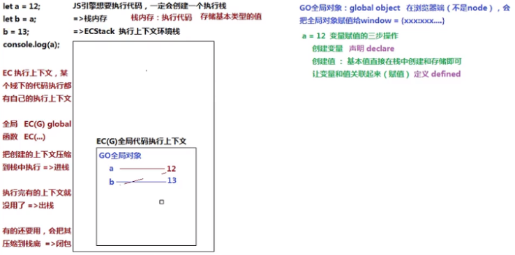
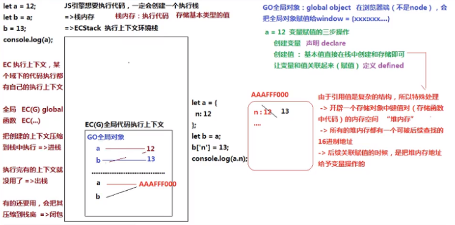
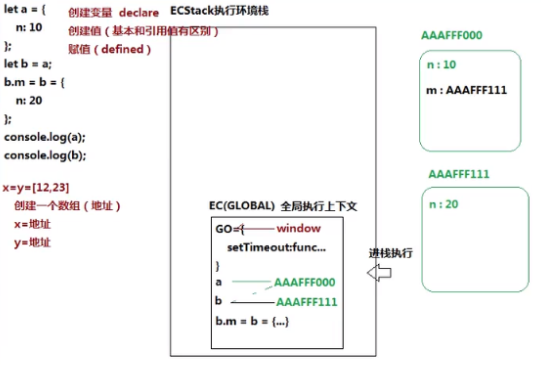
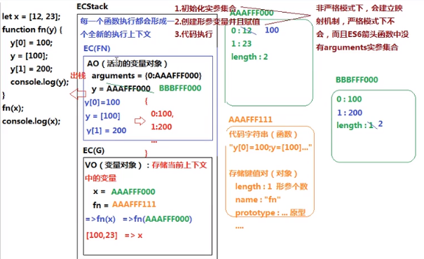
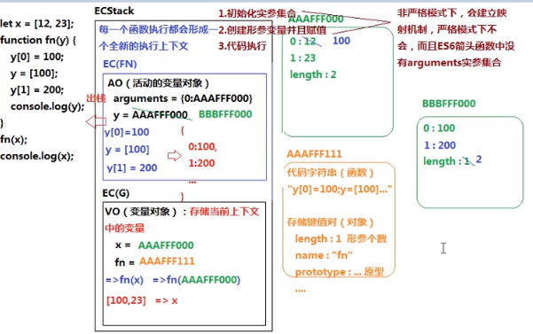

# 堆（heap）栈（stack）内存

## 1 栈：
  - 栈区内存 由编译器自动分配释放 ，存放函数的参数值，局部变量的值等
  - 栈是一种LIFO（Last-In-First-Out，后进先出）的数据结构，也就是最新添加的项最早被移除
  - 主要存放一些基本类型的变量和对象的引用；
  - 对于基本类型的数据简单，所占用空间比较小，且内存由系统自动分配；
  - 因此 栈的存取速度会比堆快，且栈中的数据可以共享；
  - 但是存在栈中的数据大小与生存期必须是确定的，缺乏灵活性

## 2 堆：
  - 堆区内存 一般由程序员分配释放，若程序员不释放，程序结束时可能由垃圾回收机制回收。
  - 存放引用类型，包含引用类型的变量，实际上保存的不是变量本身，而是指向该对象的指针。

  - 用于复杂数据类型（引用类型）分配空间 
  - 例如 数组 object function 等对象
  - 引用类型数据比较复杂，计算机为了较少反复的创建和回收引用类型数据所带来的消耗
  - 就先为其开辟另外一部分空间，以便于这些占用空间较大的数据重复利用
  - 堆内存中的数据不会随着方法的结束立即销毁，有可能该对象会被其它方法引用
  - 直到系统的垃圾回收机制检索到该对象没被任何方法所引用的时候才会对其进行回收

## 3 栈和堆的区别
  - 堆区（heap）：    
    - 堆内存中的对象不会随方法的结束而销毁，即便方法结束了，这个对象可能被另一个引用变量所以引用，创建对象是为了反复利用，这个对象将被保存到运行时数据区域。
      
  - 栈区（stack）：   
    - 所有在方法中定义的变量都是存放在栈中的，随着方法的执行结束，这个方法的内存栈也自然销毁。存取速度比较快。

## 4. 实例：
  ### 4.1 栈内存
  ```js
   let a = 12;
   let b = a;
   b = 13;
   console.log(a);
  ```

js 要执行代码，就一定会创建一个执行栈；
在栈中可以存储基本类型值；







