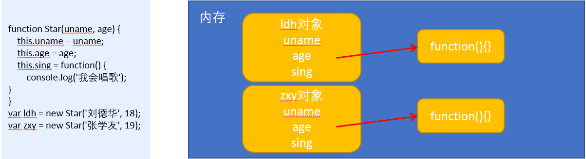

# 构造函数

## 1. 概述
  - ES6， 全称 ECMAScript 6.0 ，2015.06 发版。但是目前浏览器的 JavaScript 是 ES5 版本，大多数高版本的浏览器也支持 ES6，不过只实现了 ES6 的部分特性和功能。
  - 在 ES6之前 ，对象不是基于类创建的，而是用一种称为构建函数的特殊函数来定义对象和它们的特征。

## 2. 创建对象（三种方式）

  #### 2.1 利用 new Object() 创建对象
  ```js
    var obj1 = new Object();
  ```

  #### 2.2. 利用 对象字面量创建对象
  ```js
    var obj2 = {};
  ```

  #### 2.3 利用构造函数创建对象
  ```js
    function Star(uname, age) {
      this.uname = uname;
      this.age = age;
      this.sing = function() {
        console.log('我会唱歌');
      }
    }
    var ldh = new Star('刘德华', 18);
    var zxy = new Star('张学友', 19);
    console.log(ldh);
    ldh.sing();
    zxy.sing();
  ```
  
## 3. new 在执行时会做四件事情
- 在内存中创建一个新的空对象。
- 让 this 指向这个新的对象。
- 执行构造函数里面的代码，给这个新对象添加属性和方法。
- 返回这个新对象（所以构造函数里面不需要 return ）。

## 4. 构造函数
  - **构造函数**是一种特殊的函数，主要用来初始化对象，即为对象成员变量赋初始值，它总与 **new** 一起使用。
  - 我们可以把对象中一些 **公共的属性** 和 **方法** 抽取出来，然后**封装**到这个函数里面。
  - 构造函数中可以添加一些成员(静态成员/实例成员)，可以在构造函数本身上添加，也可以在构造函数内部的 this 上添加

## 5. 静态成员/实例成员
  - 静态成员：在构造函数本上添加的成员称为**静态成员，只能由构造函数本身来访问** 
  - 实例成员：在构造函数内部创建的对象成员称为**实例成员，只能由实例化的对象来访问**
```js
  // 构造函数中的属性和方法我们称为成员, 成员可以添加
  function Star(uname, age) {
    this.uname = uname;
    this.age = age;
    this.sing = function() {
      console.log('我会唱歌');
    }
  }
  var ldh = new Star('刘德华', 18);

  // 1.实例成员就是构造函数内部通过this添加的成员 uname age sing 就是实例成员
  // 实例成员只能通过实例化的对象来访问
  console.log(ldh.uname);
  ldh.sing();
  // console.log(Star.uname); // 不可以通过构造函数来访问实例成员
  
  // 2. 静态成员 在构造函数本身上添加的成员  sex 就是静态成员
  Star.sex = '男';
  // 静态成员只能通过构造函数来访问
  console.log(Star.sex);
  console.log(ldh.sex); // 不能通过对象来访问
```

## 6. 构造函数的问题
> 构造函数方法很好用，但是存在浪费内存的问题。



- 根据Star函数，创建了两个实例对象 ldh 和 zxy  
- Star 函数内有一个 sing 方法， sing方法是复杂数据类型，会在内存中开辟新的内存空间；  
- 所以在这里实例的时候，同一个方法，开辟出两个内存空间，造成了内存浪费；  
