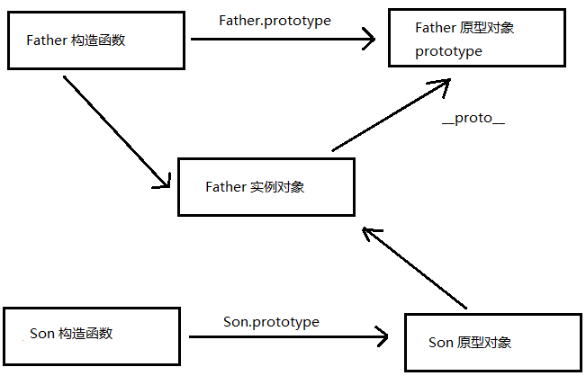

# 继承
 > ES6之前并没有给我们提供 extends 继承。我们可以通过 <font color="red">构造函数+原型对象</font> 模拟实现继承，被称为组合继承。

 ## call
  > 调用这个函数, 并且修改函数运行时的 this 指向   
  > fun.call(thisArg, arg1, arg2, ...)   
  > thisArg ：当前调用函数 this 的指向对象  
  > arg1，arg2：传递的其他参数  
  ```js
    // call 方法
    function fn(x, y) {
      console.log('我想喝手磨咖啡');
      console.log(this);
      console.log(x + y);
    }
    var o = {
        name: 'andy'
    };
    // fn();
    // 1. call() 可以调用函数
    // fn.call();
    // 2. call() 可以改变这个函数的this指向 此时这个函数的this 就指向了o这个对象
    fn.call(o, 1, 2);
  ```
  1. call 也是调用函数的一种方法，可以调用函数
  2. 传入参数，第一个是this的指向，也就实现了改变this指向
  3. arg1, arg2, ...则是传递的其他参数；  
  <font color="red">总结： call 可以实现调用函数，也可以改变this指向</font>

 ## 借用构造函数继承父类型属性
  - 核心原理： **通过 call() 把父类型的 this 指向子类型的 this** ，这样就可以实现子类型继承父类型的属性。  
  ```js
    // 借用父构造函数继承属性
    // 1. 父构造函数
    function Father(uname, age) {
      // this 指向父构造函数的对象实例
      this.uname = uname;
      this.age = age;
    }

    // 2 .子构造函数 
    function Son(uname, age, score) {
      // this 指向子构造函数的对象实例
      Father.call(this, uname, age); // 把Father中的this指向Son构造函数
      this.score = score;
    }

    var son = new Son('刘德华', 18, 100);
    console.log(son);   // Son {uname: "刘德华", age: 18, score: 100}
  ```

 ## 借用原型对象继承父类型方法
  > 一般情况下，对象的方法都在构造函数的原型对象中设置，通过构造函数无法继承父类方法
  - 核心原理： 
    - 将子类所共享的方法提取出来，让子类的 prototype 原型对象 = new 父类()  
    - 本质：子类原型对象等于是实例化父类，因为父类实例化之后另外开辟空间，就不会影响原来父类原型对象
    - 将子类的 constructor 从新指向子类的构造函数

  ```js
    // 借用原型对象继承父类型方法

    // 1. 父构造函数
    function Father(uname, age) {
        // this 指向父构造函数的对象实例
        this.uname = uname;
        this.age = age;
    }
    Father.prototype.money = function() {
        console.log(100000);
    };

    // 2 .子构造函数 
    function Son(uname, age, score) {
        // this 指向子构造函数的对象实例
        Father.call(this, uname, age);
        this.score = score;
    }

    // 注：
    // Son.prototype = Father.prototype;  
    // 直接把父构造函数原型对象赋值给子构造函数原型对象, 
    // 在修改了子原型对象,父原型对象也会跟着一起变化

    // 这里指向了 Father 实例对象
    Son.prototype = new Father();
    
    // 如果利用对象的形式修改了原型对象,
    // 别忘了利用constructor 指回原来的构造函数
    // Son.prototype = new Father() 则指向了Fater原型对象 
    // 所以需要指回自己的构造函数 ↓↓
    Son.prototype.constructor = Son;

    // 这个是子构造函数专门的方法
    Son.prototype.exam = function() {
      console.log('孩子要考试');
    }

    var son = new Son('刘德华', 18, 100);
    console.log(son);
    console.log(Father.prototype);
    console.log(Son.prototype.constructor);
  ```
  


