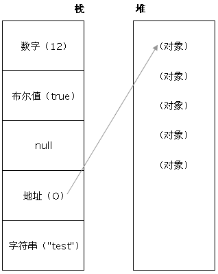

#### JavaScript
<!-- 1. 折叠所有区域代码的快捷： ctrl + k      ctrl + 0 ; 先按下  ctrl 和 K，再按下 ctrl 和 0 ; ( 注意这个是零，不是欧 )-->

<!-- 2. 展开所有折叠区域代码的快捷：ctrl +k      ctrl + J ;  先按下  ctrl 和 K，再按下 ctrl 和 J   -->

<!-- html css -->
<!-- - 前端页面有哪三层构成
- Doctype的作用,严格模式与混杂模式如何区分
- HTML结构的语义化
- HTML 与 XHTML 区别
- 盒子模型有哪些
- BFC认识
- link和@inmport的区别
- 行内元素和块元素区别
- 浮动的几种方式, 清除浮动
- 浮动元素引起的问题和解决办法
- 常见的几种居中的方法有
- CSS3 的 Flexbox（弹性盒布局模型），以及适用场景
- CSS3新特性
- html5新特性
- 常见兼容性问题 -->

<!-- 基础 -->
<!-- - let cont var 区别
- 作用域与变量声明提升
- 数据类型有哪些 
- 栈 和 堆 认识，
- 栈 和 堆 区别和联系
- 栈和队列的区别
- 内存分配
- 垃圾回收方法
- js中的内存泄露
- 严格模式的限制 -->

<!-- 数据类型 -->
<!-- - null和undefined的区别
- ES6新特性
- 数组常用方法 es6扩展
- 数组去重 
- 判断一个对象是不是数组
- Symbol 值的强制类型转换
- 深拷贝浅拷贝 -->

<!-- 函数 -->
<!-- - this 理解
- call，apply 区别和作用
- 闭包理解 为什么要用 -->

<!-- 面向对象 -->
<!-- - 创建对象的几种方式
- 继承的几种实现方式
- 原型 原型链 认识和特点
- 获取原型方法
- new操作符具体干了什么
- 用过哪些设计模式 -->

<!-- 异步编程 -->
<!-- - 异步操作认识
- 同步和异步的区别
- promise 认识 实现
- Async/Await 认识
- Generator 认识
- setTimeout 和 setInterval 区别 -->

<!-- 模块化开发 -->
<!-- - 模块化开发认识
- js 的几种模块规范
- AMD 和 CMD 规范的区别
- ES6 模块与 CommonJS 模块区别
- requireJS 的核心原理
- Es6 class语法，为什么会出现 class 这种东西
- import和export命令以及export和export default的区别 -->

<!-- 浏览器 -->
<!-- - DOM 和 BOM
- DOM 操作（添加、移除、移动、复制、创建和查找）
- 事件是什么
- 如何阻止冒泡
- 三种事件模型
- 事件委托
- iframe的优缺点
- 浏览器存储有哪些
- cookie、localStorage、sessionStorage、indexDB -->

<!-- http ajax -->
<!-- - JavaScript 的同源策略
- 为什么要有同源限制
- 解决跨域问题
- http和https的区别
- TCP传输的三次握手四次挥手策略
- URL回车后的过程
- GET和POST的区别，何时使用POST
- HTTP状态码
- 创建ajax过程
- XSS 攻击？如何防范 XSS 攻击 -->

<!-- 性能 -->
<!-- - 优雅降级和渐进增强
- 线程与进程的区别
- 对前端架构师的理解 -->


参考文章：  
[2020 前端面试：第一波面试题总结](https://www.cnblogs.com/ZXH-null/p/12294427.html)  
[web前端面试100题](https://zhuanlan.zhihu.com/p/82124513)    
[2019最新Web前端经典面试试题及答案](https://blog.csdn.net/xm1037782843/article/details/80708533)  
[2019年web前端面试题(个人面试总结)](https://www.cnblogs.com/fanfanZhao/p/12193109.html)
[2020最新前端经典面试试题](https://blog.csdn.net/weixin_42981560/article/details/103581873)
[2020最新前端中高级面试题](https://www.cnblogs.com/liuhao-web/p/11589848.html)

<!-- 基础 -->

#### let cont var 区别
  <details>
  <summary style="color: #3eaf7c;">
    <span style="cursor:pointer;color:#3eaf7c;font-size:14px;">解析</span>
  </summary>

  - var 和 let 用以声明 **变量**，const 用于声明只读的 **常量**；  
  - var 声明的变量，不存在块级作用域，在**全局范围内都有效**，let 和 const 声明的，只在它所**在的代码块内有效**；  
  - var 可以先使用，后声明；而 let 和 const 不存在变量提升，所以必须只可先声明，后使用；  
  - let 不允许在相同作用域内，重复声明同一个变量； 
  - const 在声明时必须初始化赋值，一旦声明，其声明的值就不允许改变，更不允许重复声明；

  </details>

#### 变量声明提升
  <details>
  <summary style="color: #3eaf7c;">
    <span style="cursor:pointer;color:#3eaf7c;font-size:14px;">解析</span>
  </summary>

  - 在当前作用域下，js运行之前，会把带有 var 和 function 关键字声明的 **变量先声明** 并 **安排在内存中**，
  - 也就是所有的变量的声明语句都会提升到代码最顶端，可分为 **普通的变量提升** 和 **函数声明的提升**；
  - 如果在同一个作用域下声明两个相同的变量或者函数，那么**后一个会覆盖前一个**

  </details>

#### 作用域
  <details>
  <summary style="color: #3eaf7c;">
    <span style="cursor:pointer;color:#3eaf7c;font-size:14px;">解析</span>
  </summary>

  - 作用域就是 变量 与 函数 的 **可访问范围**，在某个空间范围内，可以对数据进行读写操作；
  - 作用域有 **全局作用域**、**局部作用域** 和 es6新增的 **块级作用域**；
    - 全局作用域 在代码中任何地方都能访问到；
    - 局部作用域 一般只在固定的代码片段内可访问到
    - 块级作用域 可通过新增命令 let 和 const 声明，在指定块的作用域访问

  </details>

#### 作用域链
  <details>
  <summary style="color: #3eaf7c;">
    <span style="cursor:pointer;color:#3eaf7c;font-size:14px;">解析</span>
  </summary>

  - 作用域链的作用是保证对执行环境 **所有有权访问的变量和函数的有序访问** ，通过作用域链，我们可以访问到外层环境的变量和函数。
  - 本质上是一个指向变量对象的指针列表。变量对象是一个包含了执行环境中所有变量和函数的对象
  - 作用域链的前端始终都是当前执行上下文的变量对象。
  - 全局执行上下文的变量对象（也就是全局对象）始终是作用域链的最后一个对象。
  - 当我们查找一个变量时，如果当前执行环境中没有找到，我们可以沿着作用域链向后查找。

  </details>

#### 数据类型有哪些 
  <details>
  <summary style="color: #3eaf7c;">
    <span style="cursor:pointer;color:#3eaf7c;font-size:14px;">解析</span>
  </summary>

  - **基本数据类型**: Undefined、Null、Boolean、Number、String, 还有在 ES6 中新增的 Symbol 类型
  - **引用数据类型**：对象类型Object，比如：Object、array、function、date等
  - 区别：
    - 基本数据类型是 **存放在栈内存** 中的 **简单数据段**，**大小确定**，内存空间大小可以分配，可以**直接按值存放访问**  
    - 引用数据类型是 **存放在堆内存** 中的 **对象**，每个空间大小不一样，要根据情况进行特定的配置

  </details>
  
#### 栈 和 堆 认识
  <details>
  <summary style="color: #3eaf7c;">
    <span style="cursor:pointer;color:#3eaf7c;font-size:14px;">解析</span>
  </summary>

  - **栈**:
    - 栈区内存 由编译器自动分配释放 ，存放函数的参数值，局部变量的值等
    - 栈是一种LIFO（Last-In-First-Out，后进先出）的数据结构，也就是最新添加的项最早被移除
  - **堆**：
    - 堆区内存 一般由程序员分配释放，若程序员不释放，程序结束时可能由垃圾回收机制回收。
    - 存放引用类型，包含引用类型的变量，实际上保存的不是变量本身，而是指向该对象的指针。

  </details>

#### 栈 和 堆 区别
  <details>
  <summary style="color: #3eaf7c;">
    <span style="cursor:pointer;color:#3eaf7c;font-size:14px;">解析</span>
  </summary>

  - **栈**:
    - 所有在方法中定义的变量都是存放在栈中的，随着方法的执行结束，这个方法的内存栈也自然销毁。存取速度比较快。
  - **堆**：
    - 堆内存中的对象不会随方法的结束而销毁，即便方法结束了，这个对象可能被另一个引用变量所以引用，创建对象是为了反复利用，这个对象将被保存到运行时数据区域。
      
  </details>

#### 栈和队列的区别

#### 内存分配
  <details>
  <summary style="color: #3eaf7c;">
    <span style="cursor:pointer;color:#3eaf7c;font-size:14px;">解析</span>
  </summary>

  - JavaScript 在创建变量（对象，字符串等）时自动进行分配内存
  - 其中 **原始类型**数据值占据空间固定，是简单的数据段，为便于提升变量查询速度，将其存储在 **栈（stack）** 中  
  - 对象类型数据 大小会改变，不固定，所以不能将其存放在栈中，否则会降低变量查询速度，因此其存储在 **堆（heap）** 中 
    
      
  </details>

#### 垃圾回收方法
  <details>
  <summary style="color: #3eaf7c;">
    <span style="cursor:pointer;color:#3eaf7c;font-size:14px;">解析</span>
  </summary>

  - 当内存不再需要使用时释放；
  - JavaScript内嵌了垃圾收集器，用来跟踪内存分配和使用，以便当分配的内存不在使用时，自动释放；
  - 会 按照固定时间间隔，或代码执行中预定的收集时间，周期性执跟踪哪个变量有用哪个变量无用，对于不在有用的变量打上标记，以备将来收回占用的内存；

  - 垃圾回收策略： 
    - **标记清除**: 当变量进入环境时，将变量标记"进入环境"，当变量离开环境时，标记为："离开环境"。某一个时刻，垃圾回收器会过滤掉环境中的变量，以及被环境变量引用的变量，剩下的就是被视为准备回收的变量。
    - **引用计数**: 引用计数是跟踪记录每个值被引用的次数，当这个引用计数为0时，被视为准备回收的对象
      
  </details>

#### js中的内存泄露
  <details>
  <summary style="color: #3eaf7c;">
    <span style="cursor:pointer;color:#3eaf7c;font-size:14px;">解析</span>
  </summary>

  - 定义：程序不需要的内存，由于某些原因其不会返回到操作系统或者可用内存池中。 内存泄露会导致（运行缓慢 ，高延迟，崩溃）的问题

  - 常见的导致内存泄露的原因有：
    - 意外的全局变量引起的内存泄露  
    - 闭包引起的内存泄露  
    - 脱离文档的DOM的引用
    - 被遗忘的定时器或者回调  
      
  </details>

<!-- 函数 -->

#### this 理解
  <details>
  <summary style="color: #3eaf7c;">
    <span style="cursor:pointer;color:#3eaf7c;font-size:14px;">解析</span>
  </summary>

  - this 是执行上下文中的一个属性，它指向最后一次调用这个方法的对象。
  - 在实际开发中，this 的指向可以通过四种调用模式来判断。
    - 函数调用模式，this 指向全局对象window。
    - 方法调用模式，如果一个函数作为一个对象的方法来调用时，this 指向这个对象
    - 构造器调用模式，this 指向实例对象,原型对象里面的方法也指向实例对象
    - apply、call 和 bind 调用模式，这三个方法都可以显示的指定调用函数的 this 指向
  
  </details>

#### call，apply 区别和作用
  <details>
  <summary style="color: #3eaf7c;">
    <span style="cursor:pointer;color:#3eaf7c;font-size:14px;">解析</span>
  </summary>
  
  - call，apply 都是用于改变函数运行时上下文（改变函数内部的this指向）
  - call 和 apply 会调用函数, 并且改变函数内部this指向.
  - call 和 apply 传递的参数不一样, call 传递参数 aru1, aru2..形式  apply 必须数组形式[arg]
  - bind  不会调用函数, 可以改变函数内部this指向.
  - call 常用作做继承. apply 经常跟数组有关系

  </details>

#### 闭包理解 为什么要用
  <details>
  <summary style="color: #3eaf7c;">
    <span style="cursor:pointer;color:#3eaf7c;font-size:14px;">解析</span>
  </summary>

  - 简单来说就是函数嵌套函数，内部函数引用来外部函数的变量；
  - 作用：延伸了变量的作用范围
  - 缺点：容易造成内存泄露（ 会导致垃圾回收机制没有生效，变量被保存来下来。也就是所谓的内存泄漏 ）
  - 优点：可以避免全局变量的污染
  - 三个特性：
    - 函数嵌套函数
    - 函数内部可以引用外部的参数和变量
    - 参数和变量不会被垃圾回收机制回收
  
  </details>

<!-- 面向对象 -->

#### 创建对象的几种方式
  <details>
  <summary style="color: #3eaf7c;">
    <span style="cursor:pointer;color:#3eaf7c;font-size:14px;">解析</span>
  </summary>
  
  - [对象创建](http://cavszhouyou.top/JavaScript%E6%B7%B1%E5%85%A5%E7%90%86%E8%A7%A3%E4%B9%8B%E5%AF%B9%E8%B1%A1%E5%88%9B%E5%BB%BA.html)

  </details>

#### 继承的几种实现方式
  <details>
  <summary style="color: #3eaf7c;">
    <span style="cursor:pointer;color:#3eaf7c;font-size:14px;">解析</span>
  </summary>
  
  - **以原型链的方式来实现继承**
  - **借用构造函数的方式**
  - **组合继承**
  - **原型式继承**
  - **寄生式继承**
  - **寄生式组合继承**
  - [继承](http://cavszhouyou.top/JavaScript%E6%B7%B1%E5%85%A5%E7%90%86%E8%A7%A3%E4%B9%8B%E7%BB%A7%E6%89%BF.html)

  </details>

#### 原型 原型链 认识和特点
  <details>
  <summary style="color: #3eaf7c;">
    <span style="cursor:pointer;color:#3eaf7c;font-size:14px;">解析</span>
  </summary>
  
  - **构造函数** 是一种特殊的方法。主要用来在创建对象时初始化对象。

  - **原型**: 在JavaScript中,每个构造函数都有 **prototype(原型)**属性值，这个属性值是一个对象
    - 这个对象包含了可以由该构造函数的所有 **实例共享的属性和方法**，即这个原型对象是用来给实例共享属性和方法的。而每个实例内部都有一个指向原型对象的指针 

  - **对象原型 proto**: 在每个对象都会有一个属性 proto 指向构造函数的 prototype 原型对象

  - **原型链**: 
    - 当我们访问一个对象的属性时，如果这个对象内部不存在这个属性，那么它就会去它的原型对象里找这个属性，这个原型对象又会有自己的原型，于是就这样一直找下去，也就是原型链的概念。
    - 原型链的尽头一般来说都是 Object.prototype 所以这就是我们新建的对象为什么能够使用 toString() 等方法的原因。
  
  - **this**: 指向我们实例对象;

  </details>

#### 获取原型方法
  <details>
  <summary style="color: #3eaf7c;">
    <span style="cursor:pointer;color:#3eaf7c;font-size:14px;">解析</span>
  </summary>
  
  - p.proto : **对象原型 proto 指向构造函数的 prototype 原型对象**
  - p.constructor.prototype： **coustructor记录该对象引用于哪个构造函数**
  - Object.getPrototypeOf(p)： **ES6提供的操作方法**

  </details>

#### new操作符具体干了什么
  <details>
  <summary style="color: #3eaf7c;">
    <span style="cursor:pointer;color:#3eaf7c;font-size:14px;">解析</span>
  </summary>
  
  - 在内存中创建一个新的空对象。
  - 让 this 指向这个新的对象。
  - 执行构造函数里面的代码，给这个新对象添加属性和方法。
  - 返回这个新对象（所以构造函数里面不需要 return ）。

  </details>

#### 用过哪些设计模式
  <details>
  <summary style="color: #3eaf7c;">
    <span style="cursor:pointer;color:#3eaf7c;font-size:14px;">解析</span>
  </summary>
  
  </details>

<!-- 数据类型 -->

#### null和undefined的区别
  <details>
  <summary style="color: #3eaf7c;">
    <span style="cursor:pointer;color:#3eaf7c;font-size:14px;">解析</span>
  </summary>

  - **null表示没有对象，即该处不应该有值**
    - 作为函数的参数，表示该函数的参数不是对象
    - 作为对象原型链的终点

  - **undefined表示缺少值，即此处应该有值，但没有定义**
    - 定义了形参，没有传实参，显示undefined
    - 对象属性名不存在时，显示undefined
    - 函数没有写返回值，即没有写return，拿到的是undefined
    - 写了return，但没有赋值，拿到的是undefined

  </details>

#### 严格模式
<details>
  <summary style="color: #3eaf7c;">
    <span style="cursor:pointer;color:#3eaf7c;font-size:14px;">解析</span>
  </summary>

  - ES6引入严格模式
    - 变量必须声明后在使用
    - 函数的参数不能有同名属性, 否则报错
    - 不能使用with语句 (说实话我基本没用过)
    - 不能对只读属性赋值, 否则报错
    - 不能使用前缀0表示八进制数,否则报错 (说实话我基本没用过)
    - 不能删除不可删除的数据, 否则报错
    - 不能删除变量delete prop, 会报错, 只能删除属性delete global[prop]
    - eval不会在它的外层作用域引入变量
    - eval和arguments不能被重新赋值
    - arguments不会自动反映函数参数的变化
    - 不能使用arguments.caller (说实话我基本没用过)
    - 不能使用arguments.callee (说实话我基本没用过)
    - 禁止this指向全局对象
    - 不能使用fn.caller和fn.arguments获取函数调用的堆栈 (说实话我基本没用过)
    - 增加了保留字（比如protected、static和interface）
    
  </details>
    

#### ES6新特性
  <details>
  <summary style="color: #3eaf7c;">
    <span style="cursor:pointer;color:#3eaf7c;font-size:14px;">解析</span>
  </summary>

  - ES6引入来严格模式
  - 新增的变量声明let、const；块级作用域
  - 变量解构赋值
  - 字符串扩展
    - includes()：返回布尔值，表示是否找到了参数字符串。
    - startsWith()：返回布尔值，表示参数字符串是否在原字符串的头部。
    - endsWith()：返回布尔值，表示参数字符串是否在原字符串的尾部。
  - 数值的扩展
    - Number.isFinite()用来检查一个数值是否为有限的（finite）。
    - Number.isNaN()用来检查一个值是否为NaN。
  - 对象的扩展
    - 对象的解构
  - 数组的扩展
    - 扩展运算符
  - 新增symbol数据类型
  - Set 和 Map 数据结构
    - Set 类似于数组，但是成员的值都是唯一的，没有重复的值。Set 本身是一个构造函数，用来生成 Set 数据结构。
    - Map 类似于对象，也是键值对的集合，但是“键”的范围不限于字符串，各种类型的值（包括对象）都可以当作键。
  - 新增异步编程解决方案 Promise、Generator、async
    - Promise
    - Generator
    - async
  - 新增 类 和 模块
    - class 跟 let、const 一样：不存在变量提升、不能重复声明.
    - 
  - [更多](https://www.cnblogs.com/ZXH-null/p/12294427.html)

  </details>

#### 数组常用方法 
  <details>
  <summary style="color: #3eaf7c;">
    <span style="cursor:pointer;color:#3eaf7c;font-size:14px;">解析</span>
  </summary>

  方法|详情|
  ---|:--:|---:
  join | 将元素都转化为字符串并连接在一起
  concat | 连接两或多个数组
  slice | 选取元素
  pop   | 删除最后一个，并返回最后一个元素
  shift  | 删除第一个,并返回第一个元素的值
  splice | 删除元素并添加新元素
  push | 末尾添加元素
  unshift | 向数组开头添加元素
  reverse | 颠倒顺序
  sort|排序

  </details>

#### es6 数组扩展
  <details>
  <summary style="color: #3eaf7c;">
    <span style="cursor:pointer;color:#3eaf7c;font-size:14px;">解析</span>
  </summary>

  方法|详情|返回值
  ---|:--:|---:
  find | 找出第一个符合条件的数组成员 | 成员 or undefined
  findIndex | 找出第一个符合条件的数组成员的位置 | 位置 or -1
  fill | 填充一个数组 | ['a', 'b', 'c'].fill(7, 1, 2) => ['a', 7, 'c']
  includes | 检测数组是否包含指定元素 | 布尔值
  flat   | 将嵌套的数组“拉平”
  flatMap  | 对原数组的每个成员执行一个函数
  entries | 对键值对的遍历
  keys | 对键名的遍历
  values | 对键值的遍历
  

  </details>

#### 数组去重 
  <details>
  <summary style="color: #3eaf7c;">
    <span style="cursor:pointer;color:#3eaf7c;font-size:14px;">解析</span>
  </summary>

  - es6 方法
    - 利用 Set 去重 （ES6中最常用）
    - 利用 filter 去重
    - 利用 Map 数据结构去重
    - 利用 includes
    - 利用对象特性去重 Object.keys

  - es5 方法
    - 利用for嵌套for，然后splice去重（ES5中最常用）
    - 利用递归去重（ES5中最常用）
    - 利用 indexOf() 和 lastIndexOf() 去重
    

  </details>

#### typeof 和 instanceof 区别
  <details>
  <summary style="color: #3eaf7c;">
    <span style="cursor:pointer;color:#3eaf7c;font-size:14px;">解析</span>
  </summary>

  - typeof 和 instanceof 常用来判断一个变量是否为空，或者是什么类型的

  - **typeof**
    - typeof 用于判断基本类型（number、boolean、string、function、object、undefined）
    - typeof {} 和 typeof [] 的结果都是 object
    ```js
      typeof 123   // number
      typeof '123' // string
      typeof false // boolean
      typeof NaN   // number
      typeof undefined  // unfined
    ```

  - **instanceof 运算符**
    - 判断变量是否为某个对象的实例，返回值为true或false。。
    ```js
      var o = {};
      var a = [];
      o instanceof Array    // false
      a instanceof Array    // true
      a instanceof Object   // true
    ```

  </details>

#### 判断一个对象是不是数组
  <details>
  <summary style="color: #3eaf7c;">
    <span style="cursor:pointer;color:#3eaf7c;font-size:14px;">解析</span>
  </summary>

  - typeof {}和typeof []的结果都是object，所以简单的typeof运算符是不能够达到目的;

  - **Array.prototype.isPrototypeOf(obj)**,从原型入手;
    - 利用isPrototypeOf()方法，判定Array是不是在obj的原型链中，如果是，则返回true,否则false。
  - **Array.isArray()** js提供的判断数组类型
    - Array.isArray([1, 2, 3]); ==> true
  - **obj instanceof Array** 从构造函数入手
    - instanceof 运算符用来测试一个对象在其原型链中是否存在一个构造函数的 prototype 属性，返回一个布尔值。
    - [] instanceof Arry  ==> true

  </details>

#### 字符串转数组和数组转字符串
  <details>
  <summary style="color: #3eaf7c;">
    <span style="cursor:pointer;color:#3eaf7c;font-size:14px;">解析</span>
  </summary>

  - **字符转换数组（Split）**
    ```js
      "1,2,3".split(','); 
      // ["1", "2", "3"]
    ```
  - **数组转换字符串（Join）** 
    ```js
      ["1", "2", "3"].join(",");
      // "1,2,3"
    ```

  </details>

#### Symbol 值的强制类型转换
  <details>
  <summary style="color: #3eaf7c;">
    <span style="cursor:pointer;color:#3eaf7c;font-size:14px;">解析</span>
  </summary>

  - ES6中引入了一种新的基础数据类型, 表示**独一无二**的值
  - 常用来：作为对象属性名（key）、替代常量、定义类的私有属性/方法
  
  </details>

#### 深拷贝浅拷贝
 <details>
  <summary style="color: #3eaf7c;">
    <span style="cursor:pointer;color:#3eaf7c;font-size:14px;">解析</span>
  </summary>

  - 深拷贝：增加一个指针 和 开辟新内存，使得指针指向
    - 在计算机中开辟一块新的内存地址用于存放复制的对象
    - 通过ES6新特性 **Object.assign()** 与扩展运算符来达到浅拷贝的目的

  - 浅拷贝：只是增加了一个指针指向已存在的内存地址
    - 仅是指向被复制的内存地址，如果原地址发生改变，那么浅复制出来的对象也会相应的改变

  - 区别在于是否真正获取一个 **对象的复制实体**，而不是 **引用**

  - 实现深拷贝方法：
    - 递归复制所有层级属性
    - 借用JSON对象的parse和stringify
  
  </details>

<!-- 异步编程 -->

#### 异步操作认识
  <details>
  <summary style="color: #3eaf7c;">
    <span style="cursor:pointer;color:#3eaf7c;font-size:14px;">解析</span>
  </summary>
  
  </details>

#### 同步和异步的区别
  <details>
  <summary style="color: #3eaf7c;">
    <span style="cursor:pointer;color:#3eaf7c;font-size:14px;">解析</span>
  </summary>

  - 同步 在执行完一个函数或方法之后，等待结果，这个程序处于阻塞，只有接受到返回结果才往下执行其他代码；  
  - 异步 执行完函数或者方法后，不会阻塞等待返回结果，而是程序会继续往下执行；
  
  - es6 新增了 promise  Async/Await Generator 函数解决异步编程

  </details> 

#### promise 认识 实现
  <details>
  <summary style="color: #3eaf7c;">
    <span style="cursor:pointer;color:#3eaf7c;font-size:14px;">解析</span>
  </summary>
  
  - promise 是异步编程的一种解决方案；
  - promise 其实是一个构造函数，自身带有reject resolve 方法，原型上有 then catch 方法；
  - 对象状态不会受外界影响，带有三种状态： pending(进行中)、fulfilled(操作成功)、rejected(操作失败)；
  - 一旦状态改变，就不会再变化，任何时候都可以得到这个结果；
    - 对象改变两种可能：pending -> fulfilled 和 pending -> rejected

  </details>

#### Async/Await 认识
  <details>
  <summary style="color: #3eaf7c;">
    <span style="cursor:pointer;color:#3eaf7c;font-size:14px;">解析</span>
  </summary>
  
  - async 其实是 Generator 函数的语法糖，是对 Generator 函数的改进，
  - 自带了执行器，有更好的语义化，更广的使用范围，返回的是 promise 对象；
  - 使用时需要注意：  
    - 任何一个await语句后面的 promise 对象变为 reject 状态，整个 async 就会中断执行  
    - 返回的 promise 对象 必须等待内部所有 await 命令后的 promise 对象执行完毕，才会发生状态改变   

  </details>

#### Generator 认识
  <details>
  <summary style="color: #3eaf7c;">
    <span style="cursor:pointer;color:#3eaf7c;font-size:14px;">解析</span>
  </summary>
  
  - ES6 提供的一种异步编程解决方案，是一种状态机，封装了多个内部状态，会返回一个遍历器对象，每次都需手动去调用 next 方法，直到所有 yield 表达式结束
  - 
  </details>

#### setTimeout 和 setInterval 区别
  <details>
  <summary style="color: #3eaf7c;">
    <span style="cursor:pointer;color:#3eaf7c;font-size:14px;">解析</span>
  </summary>

  - **setTimeout** 
    - 指定时间后只会执行一次 （只执行一次）， 一般在方法内部使用达到循环调用的效果
  - **setInterval**
    - 每隔指定时间执行一次  （一直执行，直到手动销毁），一般在方法外部使用就可以达到循环调用效果
  
  </details>

<!-- 模块化开发 -->

#### 模块化开发认识
  <details>
  <summary style="color: #3eaf7c;">
    <span style="cursor:pointer;color:#3eaf7c;font-size:14px;">解析</span>
  </summary>

  
  - 模块化开发，一个模块实现一个特定功能, 这样就 **可以避免变量污染，命名冲突,提高代码复用率,提高维护性,依赖关系的管理**;

  - 在 ES6 之前，JavaScript并不支持模块化，但是存在一些模块化的解决方法 commonJs AMD CMD,直到es6提出了模块化开发方案 module;

  </details>


#### js 的几种模块规范
  <details>
  <summary style="color: #3eaf7c;">
    <span style="cursor:pointer;color:#3eaf7c;font-size:14px;">解析</span>
  </summary>

  - **CommonJS**: node应用中使用的是commonJs，它通过 require 来引入模块，通过 module.exports 定义模块的输出接口。这种模块加载方案是服务器端的解决方案，它是以同步的方式来引入模块的
  - **AMD**： 采用异步加载的方式来加载模块，模块的加载不影响后面语句的执行，所有依赖这个模块的语句都定义在一个回调函数里，等到加载完成后再执行回调函数。require.js 实现了 AMD 规范。
  - **CMD**： 
  - **ES6 使用 import 和 export 形式来导入导出模块**：

  </details>


#### AMD 和 CMD 规范的区别
  <details>
  <summary style="color: #3eaf7c;">
    <span style="cursor:pointer;color:#3eaf7c;font-size:14px;">解析</span>
  </summary>

  - 1. **模块定义时对依赖的处理不同**。AMD 推崇依赖前置，在定义模块的时候就要声明其依赖的模块。而 CMD 推崇 就近依赖，只有在用到某个模块的时候再去 require。

  - 2. **对依赖模块的执行时机处理不同**。首先 AMD 和 CMD 对于模块的加载方式都是异步加载，不过它们的区别在于 模块的执行时机，AMD 在依赖模块加载完成后就直接执行依赖模块，依赖模块的执行顺序和我们书写的顺序不一定一致。而 CMD 在依赖模块加载完成后并不执行，只是下载而已，等到所有的依赖模块都加载好后，进入回调函数逻辑，遇到 require 语句 的时候才执行对应的模块，这样模块的执行顺序就和我们书写的顺序保持一致了。 
  
  </details>

#### ES6 模块与 CommonJS 模块区别
  <details>
  <summary style="color: #3eaf7c;">
    <span style="cursor:pointer;color:#3eaf7c;font-size:14px;">解析</span>
  </summary>

  - 1. CommonJS 模块输出的是一个 **值的拷贝**，ES6 模块输出的是 **值的引用**。
  - 2. CommonJS 模块是 **运行时加载**，ES6 模块是 **编译时输出接口**
  
  </details>

#### requireJS 的核心原理
  <details>
  <summary style="color: #3eaf7c;">
    <span style="cursor:pointer;color:#3eaf7c;font-size:14px;">解析</span>
  </summary>

  - require.js 的核心原理是通过动态创建 script 脚本来异步引入模块，然后对每个脚本的 load 事件进行监听，如果每个脚本都加载完成了，再调用回调函数。
  
  </details>

#### Es6 class语法，为什么会出现 class 这种东西
  <details>
  <summary style="color: #3eaf7c;">
    <span style="cursor:pointer;color:#3eaf7c;font-size:14px;">解析</span>
  </summary>

  - class 跟let、const一样：不存在变量提升、不能重复声明.
  - ES6 的 class 只是为了补充 js 中缺少的一些面向对象语言的特性，
  - 本质上来说它只是一种语法糖，让对象原型的写法更加清晰、更像面向对象编程的语法
  - 在 class 中添加的方法，其实是添加在类的原型上的。
  
  </details>

#### import和export命令以及export和export default的区别
  <details>
  <summary style="color: #3eaf7c;">
    <span style="cursor:pointer;color:#3eaf7c;font-size:14px;">解析</span>
  </summary>

  - export 命令用于规定模块的对外接口。即**输出模块内部变量（方法、类）**
  - import 命令**加载** export 输出模块的模块
  - export default 为模块 **指定默认输出**，当其他模块加载该模块时，import命令可以为该匿名函数指定任意名字   
  
  </details>

<!-- 浏览器 -->

#### DOM 和 BOM
  <details>
  <summary style="color: #3eaf7c;">
    <span style="cursor:pointer;color:#3eaf7c;font-size:14px;">解析</span>
  </summary>

  - DOM 文档对象模型, W3C 的标准, 所有浏览器公共遵守的标准
    - 把文档当做一个对象来对待，这个对象主要定义了处理网页内容的方法和接口

  - BOM 浏览器对象模型
    - 把浏览器当做一个对象来对待，这个对象主要定义了与浏览器进行交互的法和接口。
    - BOM 的核心是 window,既是通过js访问浏览器窗口的一个接口，又是一个Global（全局）对象; DOM 的最根本的对象 document 对象也是 BOM 的 window 对象的子对象
  
  </details>

#### DOM 操作（添加、移除、移动、复制、创建和查找）
  <details>
  <summary style="color: #3eaf7c;">
    <span style="cursor:pointer;color:#3eaf7c;font-size:14px;">解析</span>
  </summary>

  - 创建新节点
  ```JS
    createDocumentFragment()    //创建一个DOM片段
    createElement_x()   //创建一个具体的元素
    createTextNode()   //创建一个文本节点
  ```
  - 添加、移除、替换、插入
  ```JS
    appendChild()
    removeChild()
    replaceChild()
    insertBefore()

  ```
  - 查找
  ```JS
    getElementsByTagName()    //通过标签名称
    getElementsByName()    //通过元素的Name属性的值
    getElementById()    //通过元素Id，唯一性
  ```
  
  </details>

#### 事件是什么, IE 与火狐的事件机制有什么区别
  <details>
  <summary style="color: #3eaf7c;">
    <span style="cursor:pointer;color:#3eaf7c;font-size:14px;">解析</span>
  </summary>

  - 1. 事件是用户操作网页时发生的交互动作或者网页本身的一些操作

  - 2. 事件处理机制：IE 支持事件冒泡、Firefox 同时支持两种事件模型，也就是：事件冒泡和事件捕获。
  
  </details>

#### JS事件冒泡, 如何阻止冒泡
  <details>
  <summary style="color: #3eaf7c;">
    <span style="cursor:pointer;color:#3eaf7c;font-size:14px;">解析</span>
  </summary>

  - 事件冒泡
    - 当一个子元素的事件被触发的时候（如onclick事件），该事件会从事件源（被点击的子元素）开始逐级向上传播，触发父级元素的点击事件。
  
  - 阻止冒泡
    - `ev.stopPropagation()`; 注意旧ie的方法`ev.cancelBubble = true`;
  ```js
    e.cancelBubble=true;
    e.stopPropagation();
    return false;
  ```
  
  </details>

#### 事件委托
  <details>
  <summary style="color: #3eaf7c;">
    <span style="cursor:pointer;color:#3eaf7c;font-size:14px;">解析</span>
  </summary>

  - 事件委托 本质上是利用了 **浏览器事件冒泡** 的机制。
    - 因为事件在冒泡过程中会上传到父节点，并且父节点可以通过事件对象获取到目标节点，
    - 因此**可以把子节点的监听函数定义在父节点上，由父节点的监听函数统一处理多个子元素的事件**，这种方式称为 **事件代理**

  - **使用事件代理**   
    - 我们可以不必要为每一个子元素都绑定一个监听事件，这样 **减少了内存上的消耗**。
    - **可以实现事件的动态绑定**，比如说新增了一个子节点，我们并不需要单独地为它添加一个监听事件，它所发生的事件会交给父元素中的监听函数来处理。

  详细资料可以参考： [《JavaScript 事件委托详解》](https://zhuanlan.zhihu.com/p/26536815)
  
  </details>

#### 三种事件模型
  <details>
  <summary style="color: #3eaf7c;">
    <span style="cursor:pointer;color:#3eaf7c;font-size:14px;">解析</span>
  </summary>

  - 第一种事件模型是最早的 DOM0 级模型，这种模型不会传播，所以没有事件流的概念，但是现在有的浏览器支持以冒泡的方式实现，它可以在网页中直接定义监听函数，也可以通过 js 属性来指定监听函数。这种方式是所有浏览器都兼容的。

  - 第二种事件模型是 IE 事件模型，在该事件模型中，一次事件共有两个过程，事件处理阶段，和事件冒泡阶段。事件处理阶段会首先执行目标元素绑定的监听事件。然后是事件冒泡阶段，冒泡指的是事件从目标元素冒泡到 document，依次检查经过的节点是否绑定了事件监听函数，如果有则执行。这种模型通过 attachEvent 来添加监听函数，可以添加多个监听函数，会按顺序依次执行。

  - 第三种是 DOM2 级事件模型，在该事件模型中，一次事件共有三个过程，第一个过程是事件捕获阶段。捕获指的是事件从 document 一直向下传播到目标元素，依次检查经过的节点是否绑定了事件监听函数，如果有则执行。后面两个阶段和 IE 事件模型的两个阶段相同。这种事件模型，事件绑定的函数是 addEventListener，其中第三个参数可以指定事件是否在捕获阶段执行。
  
  </details>

#### iframe的优缺点
  <details>
  <summary style="color: #3eaf7c;">
    <span style="cursor:pointer;color:#3eaf7c;font-size:14px;">解析</span>
  </summary>

  - 优点：
    1. 解决加载缓慢的第三方内容如图标和广告等的加载问题
    2. Security sandbox
    3. 并行加载脚本

  - 缺点：
    1. iframe会阻塞主页面的Onload事件
    2. 即时内容为空，加载也需要时间
    3. 没有语意

  </details>

#### 浏览器存储有哪些
  <details>
  <summary style="color: #3eaf7c;">
    <span style="cursor:pointer;color:#3eaf7c;font-size:14px;">解析</span>
  </summary>

  - [浏览器存储](https://www.cnblogs.com/yanggb/p/10675855.html)
  
  </details>

#### cookie、localStorage、sessionStorage区别
  <details>
  <summary style="color: #3eaf7c;">
    <span style="cursor:pointer;color:#3eaf7c;font-size:14px;">解析</span>
  </summary>
  
  - 共同点：都是保存在浏览器端、且同源的
  - 不同点：
    - cookie 数据始终在同源的http请求中携带（即使不需要），即cookie在浏览器和服务器间来回传递。  
      cookie 数据还有路径（path）的概念，可以限制 cookie 只属于某个路径下  
      sessionStorage 和 localStorage 不会自动把数据发送给服务器，仅在本地保存。   

    - **存储大小限制不同**，cookie数据不能超过4K，sessionStorage和localStorage可以达到5M

    - localStorage 用于持久化的本地存储，除非主动删除数据，否则数据是永远不会过期的，窗口或浏览器关闭也一直保存，本地存储

    - sessionStorage 是一种会话级别的存储，仅在当前**浏览器窗口关闭之前**有效，即使是同一个页面,在不同的浏览器窗口中不能共享；  

    - cookie: 只在**设置的 cookie 过期时间**之前有效，即使窗口关闭或浏览器关闭，也是在所有同源窗口中都是共享的.也就是说只要浏览器不关闭，数据仍然存在 
    
    - [浅谈浏览器存储](https://www.cnblogs.com/qiujianmei/p/10824682.html) 
  
  </details>

<!-- http ajax -->

#### JavaScript 的同源策略
  <details>
  <summary style="color: #3eaf7c;">
    <span style="cursor:pointer;color:#3eaf7c;font-size:14px;">解析</span>
  </summary>

  - 同源指的是 **协议，域名，端口** 相同，是一种安全策略，指一段脚本只能读取来自同一来源的窗口和文档的属性
  
  </details>

#### 解决跨域问题
  <details>
  <summary style="color: #3eaf7c;">
    <span style="cursor:pointer;color:#3eaf7c;font-size:14px;">解析</span>
  </summary>

  - 跨域：因为浏览器出于安全考虑，有同源策略。如果协议、域名或者端口有一个不同就是跨域，Ajax 请求就会失败

  - 1. **jsonp** 主要利用 script 标签没有跨域限制，通过**动态插入 script  标签** 指向一个需要访问的地址并提供一个回调函数来接收数据当需要通讯时，
    - JSONP 使用简单且兼容性不错，但是只限于 get 请求。
  - 2. webpack 配置 proxyTable 设置开发环境跨域
  - 3. **服务器来设置代理跨域** 的访问请求，就是有跨域的请求操作时发送请求给后端，让后端代为请求，然后最后将获取的结果发返回。

  </details>

#### ajax 创建ajax过程
  <details>
  <summary style="color: #3eaf7c;">
    <span style="cursor:pointer;color:#3eaf7c;font-size:14px;">解析</span>
  </summary>

  - ajax：是通过 JavaScript 的 异步通信，从服务器获取 XML 文档从中提取数据，再更新当前网页的对应部分，而不用刷新整个网页。 

  - 创建过程
    - 创建 XMLHttpRequest 对象,也就是 **创建一个异步调用对象**.
    - **创建一个新的 HTTP 请求**,并指定该 HTTP 请求的方法、URL及验证信息.
    - **设置 响应 HTTP 请求状态** 变化的函数.
    - 发送 HTTP 请求.
    - 获取异步调用返回的数据.
    - 使用 JavaScript 和 DOM 实现局部刷新.
  
  </details>

#### ajax的缺点和在IE下的问题
  <details>
  <summary style="color: #3eaf7c;">
    <span style="cursor:pointer;color:#3eaf7c;font-size:14px;">解析</span>
  </summary>

  - 缺点：ajax不支持浏览器back按钮；安全问题 AJAX暴露了与服务器交互的细节；对搜索引擎的支持比较弱；破坏了程序的异常机制。

  - IE缓存问题：在IE浏览器下，如果请求的方法是GET，并且请求的URL不变，那么这个请求的结果就会被缓存。
    - 解决这个问题的办法可以通过实时改变请求的URL，只要URL改变，就不会被缓存，可以通过在URL末尾添加上随机的时间戳参数('t'= + newDate().getTime())
  
  </details>

#### GET和POST的区别，何时使用POST？
  <details>
  <summary style="color: #3eaf7c;">
    <span style="cursor:pointer;color:#3eaf7c;font-size:14px;">解析</span>
  </summary>

  - GET：一般用来进行查询操作，url地址有长度限制，请求的参数都暴露在url地址当中，如果传递中文参数，需要自己进行编码操作，安全性较低
  - POST：主要用来提交数据，没有数据长度的限制，提交的数据内容存在于http请求体中，数据不会暴漏在url地址中
    - 向服务器发送大量数据，使用post。
    - 发送包含未知字符的用户输入时，POST 比 GET 更稳定也更可靠。
  
  </details>


#### URL回车后的过程
  <details>
  <summary style="color: #3eaf7c;">
    <span style="cursor:pointer;color:#3eaf7c;font-size:14px;">解析</span>
  </summary>

  - 读取缓存： 搜索自身的 DNS 缓存。(如果 DNS 缓存中找到IP 地址就跳过了接下来查找 IP 地址步骤，直接访问该 IP 地址。)
  - DNS 解析: 将域名解析成 IP 地址
  - TCP 连接：TCP 三次握手
  - 发送 HTTP 请求
  - 服务器处理请求并返回 HTTP 报文
  - 浏览器解析渲染页面
  - 断开连接：TCP 四次挥手
  
  </details>

#### TCP传输的三次握手四次挥手策略
  <details>
  <summary style="color: #3eaf7c;">
    <span style="cursor:pointer;color:#3eaf7c;font-size:14px;">解析</span>
  </summary>

  - 
  
  </details>

#### http http请求 HTTP状态码
  <details>
  <summary style="color: #3eaf7c;">
    <span style="cursor:pointer;color:#3eaf7c;font-size:14px;">解析</span>
  </summary>

  - http: 超文本传输协议。是互联网应用最为广泛的一种网络协议,所有的 www 文件都必须遵守这个标准。

  - http特性: 无连接无状态; 一般构建于 TCP/IP 协议之上，默认端口号是 80; 可以分为两个部分，即请求和响应。

  - http请求： HTTP 定义了在与服务器交互的不同方式，最常用的方法有 4 种  
    分别是 GET，POST，PUT， DELETE。URL 全称为资源描述符，可以这么认为：一个 URL 地址  
    对应着一个网络上的资源，而 HTTP 中的 GET，POST，PUT，DELETE  
    就对应着对这个资源的查询，修改，增添，删除4个操作  
    
  - HTTP 请求由 3 个部分构成: 状态行，请求头(Request Header)，请求正文

  - HTTP 响应由 3 个部分构成，分别是：状态行，响应头(Response Header)，响应正文。

  - 常见的状态码
    - 200 OK      // 客户端请求成功
    - 400 Bad Request  // 客户端请求有语法错误，不能被服务器所理解
    - 403 Forbidden  // 服务器收到请求，但是拒绝提供服务
    - 404 Not Found  // 请求资源不存在，输入了错误的URL
    - 500 Internal Server Error // 服务器发生不可预期的错误
    - 503 Server Unavailable  // 服务器当前不能处理客户端的请求，一段时间后可能恢复正常
  
  </details>

#### http 和 https的区别
  <details>
  <summary style="color: #3eaf7c;">
    <span style="cursor:pointer;color:#3eaf7c;font-size:14px;">解析</span>
  </summary>

  
  
  </details>


#### XSS 攻击？如何防范 XSS 攻击
  <details>
  <summary style="color: #3eaf7c;">
    <span style="cursor:pointer;color:#3eaf7c;font-size:14px;">解析</span>
  </summary>

  - 
  
  </details>

<!-- 性能 -->

#### 优雅降级和渐进增强
  <details>
  <summary style="color: #3eaf7c;">
    <span style="cursor:pointer;color:#3eaf7c;font-size:14px;">解析</span>
  </summary>

  - 渐进增强: 
    - 针对低版本浏览器进行构建页面，保证最基本的功能，然后再针对高级浏览器进行效果、交互等改进和追加功能达到更好的用户体验。

  - 优雅降级: 一开始就构建完整的功能，然后再针对低版本浏览器进行兼容。

  - 区别：
    - 优雅降级是从复杂的现状开始，并试图减少用户体验的供给
    - 渐进增强则是从一个非常基础的，能够起作用的版本开始，并不断扩充，以适应未来环境的需要
    - 降级（功能衰减）意味着往回看；而渐进增强则意味着朝前看，同时保证其根基处于安全地带
  
  </details>

#### 浏览器是如何渲染页面的
  <details>
  <summary style="color: #3eaf7c;">
    <span style="cursor:pointer;color:#3eaf7c;font-size:14px;">解析</span>
  </summary>

  1. 解析HTML文件，创建DOM树。
    - 自上而下，遇到任何样式（link、style）与脚本（script）都会阻塞（外部样式不阻塞后续外部脚本的加载）。
  2. 解析CSS。优先级：浏览器默认设置<用户设置<外部样式<内联样式<HTML中的style样式；
  3. 将CSS与DOM合并，构建渲染树（Render Tree）
  4. 布局和绘制，重绘（repaint）和重排（reflow）
  
  </details>

#### 重绘与重排
  <details>
  <summary style="color: #3eaf7c;">
    <span style="cursor:pointer;color:#3eaf7c;font-size:14px;">解析</span>
  </summary>
  
  - **document.write重排整个页面**
  - **innerHTML可以重绘页面的一部分**

  - **重绘** 元素外观的改变所触发的浏览器行为，浏览器会根据元素的新属性重新绘制，使元素呈现新的外观，重绘不会带来重新布局，并不一定伴随重排

  - **重排** 当渲染树中 元素的规模尺寸，布局，隐藏等发生改变而需要重新构建，就称为回流。每个页面至少需要一次回流，就是在页面第一次加载的时候；

  - **重排必定会引发重绘，但重绘不一定会引发重排**;

  - 重绘重排的**代价**：耗时，导致浏览器卡慢。

  - **优化策略**
    - 将多次改变样式属性的操作合并成一次操作。那就是以后尽量都是操作class，在vue里面最好不要使用:style属性。都是操作class就可以了
    - 将多次重排的元素设为absolute或者fixed，这样元素就脱离了文档流，他的变化不会影响到其他元素，比如有动画效果的元素
    - 在内存中多次操作节点，完成之后在添加到文档中去。
    - 图片载入的时候设置宽高
  
  </details>

#### 前端性能优化
  <details>
  <summary style="color: #3eaf7c;">
    <span style="cursor:pointer;color:#3eaf7c;font-size:14px;">解析</span>
  </summary>

  0. webapck优化、 开启gzip压缩
  1. babel-loader用 include 或 exclude 来帮我们避免不必要的转译，不转译node_moudules中的js文件
  2. 文件按需加载
  3. 尽量所使用的字体图标或者SVG图标来代替传统png图
  4. 采用图片的懒加载（延迟加载）
  5. 减少对cookie的使用，因为客户端操作cookie的时候，这些信息总是在客户端和服务端传递。如果上设置不当，每次发送一个请求将会携带cookie
  6. 在js中尽量减少闭包的使用；因为使用闭包后，闭包所在的上下文不会被释放
  7. 减少对DOM操作，主要是减少DOM的重绘与回流（重排）
  8. 避免 嵌套循环 和 "死循环" (一旦遇到死循环，浏览器就会直接卡掉)
  9. 在事件绑定中，尽可能使用事件委托，减少循环给DOM元素绑定事件处理函数。
  10. 减少css表达式的使用
  11. 避免使用 iframe 不仅不好管控样式，而且相当于在本页面又嵌套其他页面，消耗性能会更大。因为还回去加载这个嵌套页面的资源

  </details>

#### 对前端架构师的理解
  <details>
  <summary style="color: #3eaf7c;">
    <span style="cursor:pointer;color:#3eaf7c;font-size:14px;">解析</span>
  </summary>

  - 负责前端团队的管理及与其他团队的协调工作，提升团队成员能力和整体效率；
  - 带领团队完成研发工具及平台前端部分的设计、研发和维护；
  - 带领团队进行前端领域前沿技术研究及新技术调研，保证团队的技术领先
  - 负责前端开发规范制定、功能模块化设计、公共组件搭建等工作，并组织培训。
  
  </details>
