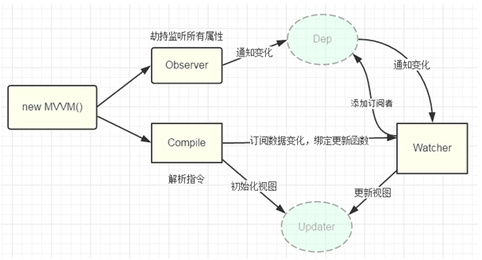

# MVVM模型带、Vue.js的双向绑定、 Obejct.defineProperty

参考文章：  
[vue实现mvvm模式](https://www.cnblogs.com/yimuzanghua/p/8547128.html)        
[MVVM模式原理及其实现](https://segmentfault.com/a/1190000018399478#item-5)     
[vue的MVVM](https://www.cnblogs.com/pengdt/p/12046431.html)    
[MVVM原理](https://juejin.im/post/5abdd6f6f265da23793c4458#heading-10)  

## 1. MVVM模式
  - MVVM 是 Model - view - ViewModel 的缩写，是一种基于前端开发的架构模式
  - 核心是提供对 view 和 viewModel 的双向数据绑定，ViewModel 的状态改变可以自动传递给 View，即所谓的双向数据绑定；
  - Model 代表数据模型
  - view  代表UI 组件，它负责将数据模型转化成UI 展现出来
  - ViewModel 就是一个同步 View 和 Model 的对象

  - vue 就是一个提供了 MVVM 风格的双向数据绑定的js 库，专注 view层，核心是 VM, ViewModel 负责连接 View 和 Model，保证视图和数据的一致性，让前端开发更高效、便捷

## 2. 实现双向绑定的做法  
  - 目前几种主流的mvc(vm)框架都实现了单向数据绑定，而我所理解的双向数据绑定无非就是在单向绑定的基础上给可输入元素（input、textare等）添加了change(input)事件，来动态修改model和 view，并没有多高深。所以无需太过介怀是实现的单向或双向绑定。  

  - 实现数据绑定的做法有大致如下几种：  
    - 发布者-订阅者模式（backbone.js）  
    - 脏值检查（angular.js）   
    - 数据劫持（vue.js）  

  - **发布者-订阅者模式**: 一般通过sub, pub的方式实现数据和视图的绑定监听，更新数据方式通常做法是 vm.set('property', value)

  - **脏值检查**: angular.js 是通过脏值检测的方式比对数据是否有变更，来决定是否更新视图，最简单的方式就是通过 setInterval() 定时轮询检测数据变动，当然Google不会这么low，angular只有在指定的事件触发时进入脏值检测，大致如下：
    - DOM事件，譬如用户输入文本，点击按钮等。( ng-click )
    - XHR响应事件 ( $http )
    - 浏览器Location变更事件 ( $location )
    - Timer事件( $timeout , $interval )
    - 执行 $digest() 或 $apply()

  - **数据劫持:** vue.js 则是采用数据劫持结合发布者-订阅者模式的方式，通过Object.defineProperty()来劫持各个属性的setter，getter，在数据变动时发布消息给订阅者，触发相应的监听回调。

## 3. MVVM及双向绑定实现

- vue 采用 **数据劫持** 结合 **发布者－订阅者模式** 的方式, 实现了数据层和视图层中的数据同步  
  **最核心** 的方法通过 **Object.defineProperty()** 来劫持各个属性的 setter，getter;   
  在属性对应数据改变时，发布消息给订阅者，然后触发相应的监听回调；

- 要实现mvvm的双向绑定，必须
  - 实现一个数据监听器 Observer, 才能对数据的所有属性进行监听，如果有变动可拿到最新的值并通知订阅者
  - 实现一个指令解析器 Compile, 对每个元素节点的指令进行扫描和解析，根据指令模板替换数据，以及绑定响应的更新函数
  - 实现一个 Watcher(观察者)， 作为Observer 和 Compile 的桥梁， 能够订阅并接收到每个属性变动的通知，执行指令绑定的相应回调函数，从而更新视图
  - mvvm入口函数，整合以上三者
  

- 以下代码总结：
  - MVVM.js 把参数传给 Observe 和 Compile
  - Observe.js 劫持监听，每个 key 都需要搭配一个 Dep，数据更新就执行 Dep.updata
  - Dep 就是一个订阅发布的数组
  - compile.js 发布 dom 元素，通过属性【v-xx】创建更新规则，每个规则创建一个 watch， watch 装在对应的位置的Dep数组里
  - Watch.js 闭包存者所有的 dom 和 对应的无数个更新规则，由 Dep 调用它的更新

#### 3.1 监听器(observe)、订阅器(dep)
  - 数据劫持： 将需要 observe 的数据对象进行递归遍历，包括子属性对象的属性，都加上 set、get ，只要对象某个属性赋值变化，就会触发 setter， 就能监听到数据的变化
    - 为什么: vue特点是不能新增不存在的属性 不存在的属性没有get和set
  - 消息订阅器: 定义一个数组，用来存放订阅者，数据变动通知（notify）订阅者，再调用订阅者的 update 方法
  ```js
    // observe.js

    //数据监听 劫持
    // 定义Object.defineProperty 实现监听 数据劫持
    class Observe {
      constructor(data){
        this.observe(data)
      }

      observe(data){
        if(!data&&typeof data !== 'object') return;
        Object.keys(data).forEach(key => {
          // 数据劫持
          this.defineReactive(data,key,data[key])
          // 深度递归劫持，保证子属性的值会被劫持
          this.observe(data[key]) 
        })
      }

      // 定义响应式，设置 set get 
      defineReactive(obj,key,val){
        let _this = this;
        let dep = new Dep();
        Object.defineProperty(obj, key, {
          enumerable: true,
          configurable: true,
          // 取值时被调用
          get() {
            // 在取值时将订阅者push入订阅者数组
            Dep.target && dep.addDep(Dep.target);
            return val;
          },
          set(newVal) {
            if(newVal !== val) {
              console.log(`监听到值变化，新值${newVal} --> 旧值${val}`)
              // 如果是对象，就继续劫持
              _this.observe(newVal); 
              val = newVal;
              //通知所有人 数据更新了
              dep.notify() 
            }
          }
        })
      }
    }

    // 消息订阅器Dep()
    //  监听到数据变化需要一个消息订阅器通知订阅者
    class Dep {
      constructor() {
        // 订阅的数组
        this.subs = []
      }
      addSub(watcher){
        // push到订阅数组
        this.subs.push(watcher)
      }
      notity(){
        // 通知订阅者，并执行订阅者的update回调
        this.subs.forEach(watcher => watcher.update())
      }
    }
  ```

#### 3.2 编译模板 （compile）
  - 主要解析模板指令，将模板中的变量替换成数据，渲染到页面视图
  - 将每个指令对应的节点绑定更新函数，添加监听数据的订阅者，
  - 接收 mvvm 中传过来的 el 和 vm 实例

  ```js
    // compile.js
    export default class Compile {
      coundtructor(el, vm) {
        // 判断是否是元素节点，是=》取该元素 否=》取文本
        this.el = this.isElementNode(el) ? el:document.querySelector(el)
        this.vm = vm
        // 如果这个元素能获取到 我们才开始编译
        if(this.el) {
          // 1. 先把真实DOM移入到内存中 fragment
          let fragment = this.node2fragment(this.el)
          // 2. 编译 =》 在fragment中提取想要的元素节点 v-model 和文本节点
          this.compile(fragment)
          // 3. 把编译好的fragment在放回到页面中
          this.el.appendChild(fragment)
        }
      }
      // 判断是否是元素节点
      isElementNode(node) {
        return node.nodeType === 1
      }
      // 是不是指令
      isDirective(name) {
        return name.includes('v-')
      }
      // 将el中的内容全部放到内存中
      // 为提高性能和效率，先将vue实例根节点的el转换成文档碎片fragment进行解析编译操作，解析完成，再将fragment添加回原来的真实dom节点中
      node2fragment(el) {
        let fragment = document.createDocumentFragment()
        let firstChild
        // 遍历取出firstChild，直到firstChild为空
        while (firstChild = el.firstChild) {
          fragment.appendChild(firstChild)
        }
        return fragment // 内存中的节点
      }

      //编译 =》 提取想要的元素节点 v-model 和文本节点
      compile(fragment) {
        // 需要递归
        let childNodes = fragment.childNodes
        Array.from(childNodes).forEach(node => {
          // 是元素节点 直接调用文本编译方法 还需要深入递归检查
          if(this.isElementNode(node)) {
            this.compileElement(node)
            // 递归深入查找子节点
            this.compile(node)
          // 是文本节点 直接调用文本编译方法
          } else {
            this.compileText(node)
          }
        })
      }

      // 编译元素方法
      compileElement(node) {
        let attrs = node.attributes
        Array.from(attrs).forEach(attr => {
          let attrName = attr.name
          // 判断属性名是否包含 v-指令
          if(this.isDirective(attrName)) {
            // 取到v-指令属性中的值（这个就是对应data中的key）
            let expr = attr.value
            // 获取指令类型
            let [,type] = attrName.split('-')
            // node vm.$data expr
            compileUtil[type](node, this.vm, expr)
          }
        })
      }
      // 这里需要编译文本
      compileText(node) {
        //取文本节点中的文本
        let expr = node.textContent
        let reg = /\{\{([^}]+)\}\}/g
        if(reg.test(expr)) {
          // node this.vm.$data text
          compileUtil['text'](node, this.vm, expr)
        }
      }
    }
    // 解析不同指令或者文本编译集合
    const compileUtil = {
      text(node, vm, expr) { // 文本
        let updater = this.updater['textUpdate']
        updater && updater(node, getTextValue(vm, expr))
      },
      // 在compile中解析不同指令或者文本编译集合的时候绑定watcher.
      model(node, vm, expr){ // 输入框
        let updater = this.updater['modelUpdate']
        // 加一个监控 数据变化了 应该调用这个watcher 的 callback
        new Watcher(vm,expr,(newValue) => {
          // 当值变化后 会调用cb，将新值传递过来
          updater && updater(node, this.getValue(vm, expr))
        })
        node.addEventListener('input',(e) => {
          let newValue = e.target.value
          this.setVal(vm, expr, newValue)
        })
        updater && updater(node, getValue(vm, expr))
      },
      // 更新函数
      updater: {
        // 文本赋值
        textUpdate(node, value) {
          node.textContent = value
        },
        // 输入框value赋值
        modelUpdate(node, value) {
          node.value = value
        }
      }
    }
    // 辅助工具函数
    // 绑定key上对应的值，从vm.$data中取到
    const getValue = (vm, expr) => {
      expr = expr.split('.') // [message, a, b, c]
      return expr.reduce((prev, next) => {
        return prev[next]
      }, vm.$data)
    }

    // 获取文本编译后的对应的数据
    const getTextValue = (vm, expr) => {
      return expr.replace(/\{\{([^}]+)\}\}/g, (...arguments) => {
        return getValue(vm, arguments[1])
      })
    }
  ```

#### 3.3 订阅中心（Watcher）
  - Observer和Compile之间通信的桥梁是Watcher订阅中心，其主要职责是:
  - 在自身实例化时网属性订阅器（Dep）里添加自己，与observe建立连接；
  - 自身必要有一个 update() 方法，与 Compile 建立连接；
  ```js
    class Watcher {
      constructor(vm, expr, cb){
        this.vm = vm
        this.expr = expr
        this.cb = cb
        // 先获取一下老值
        this.value = this.get()
      }
      // 获取实例上对应的数据
      getValue(vm, expr) {
        expr = expr.split('.')
        return expr.reduce((prev,next) => {
          return prev[next]
        },vm.$data)
      }
      get() {
        // 获取当前订阅者
        Dep.target = this
        // 触发getter，当前订阅者添加订阅器中 在 劫持数据时 将订阅者放到订阅数组
        let value = this.getValue(this.vm,this.expr)
        // 重置订阅者
        Dep.target = null
        return value
      }
      // 对外层暴露的方法
      update(){
        let newValue = this.getValue(this.vm, this.expr)
        let oldValue = this.value
        // 更新的值 与 以前的值 进行对比， 如果发生变化就更新方法
        if(newValue !== oldValue) {
          this.cb(newValue)
        }
      }

    }
  ```

#### 3.4 出口
  - MVVM作为数据绑定的入口，整合 Observer、Compile 和 Watcher 三者，通过Observer来监听自己的model数据变化，通过Compile来解析编译模板指令，最终利用Watcher搭起Observer和Compile之间的通信桥梁，达到数据变化 -> 视图更新；视图交互变化(input) -> 数据model变更的双向绑定效果。

```js
  // mvvm.js
  class MVVM {
    constructor(options) {
      this.$el = options.el
      this.$data = options.data
      // 如果有要编译的模板 =>编译
      if(this.$el) {
        // 将文本+元素模板进行编译
        new Compile(this.$el, this)
      }
    }
  }
```

## 4. Obejct.defineProperty
  > 在一个对象上定义一个新属性，或者修改一个对象的现有属性，并返回此对象 
  - Obejct.defineProperty(obj,prop,decriptor)
  - obj 要定义属性的对象
  - prop 要定义或修改的属性名称
  - descriptor 要定义或修改的属性描述（具体的改变方法）
  ```js
    let obj ={a: 1};
    Object.defineProperty(obj, 'b',{
      get: function(){
        // 拦截到数据
        console.log("get方法被调用");
      },
      set: function(value){
        // 改变数据的值
        console.log("set方法被调用", value);
      },
      
    })
    obj.b;   // get方法被调用
    obj.b = 123;   // set方法被调用
  ```
