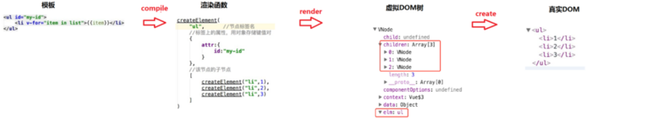
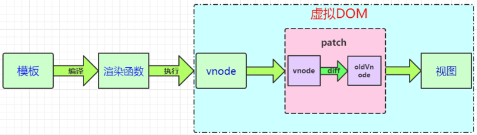
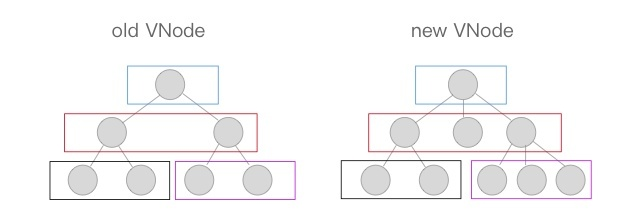

# vue 虚拟DOM、diff算法

###### 参考文章：
  [Vue 虚拟dom diff原理详解](https://segmentfault.com/a/1190000020663531?utm_source=tag-newest)   
  [Vue2.x的虚拟DOM diff原理](https://www.jianshu.com/p/bf9a8b4773ee)   
  [virtual dom 和 双向绑定](https://github.com/buppt/virtual-dom-mvvm)  

## 模板转换成视图的过程
  
  
  - **Vue.js 通过编译 template 模板转换成渲染函数（render）,执行渲染函数就是可以得到一个虚拟节点树；**
  - 在对 Model 进行操作的时候，会触发对象 Dep 中的 Watcher 对象。Watcher 对象会调用对应的 update 来修改视图。 这个过程主要是将新旧节点进行差异对比，然后根据对比结果进行DOM操作来更新视图
---
  
  - 渲染函数： 渲染函数是用来生成 VDOM 的。vue推荐使用模板构建我们的应用界面，在底层实现中 Vue 会将模板编译成渲染函数；也可以不写模板，直接写渲染函数，以获得更好的控制；
  - VNode 虚拟节点：可以代表一个真实的 dom 节点。通过 createElement 方法能将 VNode 渲染成 dom 节点。简单地说，vnode可以理解成节点描述对象，它描述了应该怎样去创建真实的DOM节点。
  - patch（也叫patching 算法）：虚拟 DOM 最核心的部分，可以将 vnode 渲染成真实的 DOM， 这个过程是对比新旧虚拟节点之间有哪些不同，然后根据对比结果找出需要更新的节点进行更新。vue 的 Virtual DOM Patching 算法是基于 Snabbdom 的实现，并在这基础做了很多调整和改进

  <font color="red">注：vue 是通过模板解析之后生成的虚拟dom</font>  

## 虚拟DOM (Virtual DOM)
  - 概念：
    - Virtual DOM 就是虚拟节点。通过js 对象模拟 DOM 中的节点，然后再通过特定的 render 方法将其渲染成真实的DOM节点
  
  - VDOM 优势
    - **具有跨平台的优势**；由于Virtual DOM 是以 js 对象作为基础而不依赖真实平台环境，所以使其具有跨平台优势
    - **提高效率**； js运算速度比DOM操作速度快，因此，把大量的DOM操作搬运到js中，运行 patching 算法计算出真正需要更新的节点，最大限度减少DOM操作
    - **提升渲染性**； Virtual DOM 可以在大量、频繁的数据更新下，对视图进行合理、高效的更新
    
  ```js
    // 实际的dom元素
    <ul id="list">
      <li  class="item">item1</li>
      <li  class="item">item2</li>
    </ul>
    // 渲染函数 （render）
    {
      tag:'ul',
      attrs:{
        id:'list'
      },
      children:[
        {
          tag:'li',
          attrs:{className:'item'}, 
          children:['item1']
        },
        {
          tag:'li',
          attrs:{className:'item'},
          children:['item2']
        }
      ]
  ```
## diff 算法
> vdom 纯粹是JS对象，操作起来很高效，但是 vdom 的变更最终会转换成 DOM 操作，为了实现高效的 DOM 操作，一套高效的虚拟DOM diff算法显得很有必要。
  - 用js对象结构表示 dom 树的结构，然后用这个树构建一个真正的 DOM 树，插到文档中
  - 当状态变更的时候，重新构造一颗新的对象树。然后用新的树和旧的树进行比较(diff),记录两颗树的差异
  - 对比两颗树的差异，用新的树覆盖旧的树，构建的真正的DOM树上(patch)，视图就更新了
  ---
   diff算法是通过同层的树节点进行比较而非对树进行逐层搜索遍历的方式，所以时间复杂度只有O(n)，是一种相当高效的算法
  