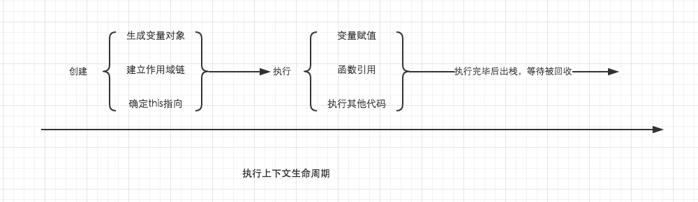

# 执行上下文


## 简介
  > javascript 在执行代码时， 会产生一个对应的执行环境； 在这个环境中，所有的变量会被事先提出来（变量提升），有的直接赋值，有的为默认值 undefined，代码从上往下开始执行，就叫做执行上下文；
#### JavaScript 三种运行环境
  1. 全局环境： 代码首先进入的环境；
  2. 函数环境： 函数被调用执行的环境；
  3. eval函数： https://www.cnblogs.com/chaoguo1234/p/5384745.html（不常用）

## 特点：
  1. 单线程，在主进程上运行；
  2. 同步执行， 从上往下按顺序执行；
  3. 全局上下文只有一个，浏览器关闭是会被弹出栈；
  4. 函数的执行上下文没有数量限制
  5. 函数每被调用一次， 都会产生一个新的执行上下文

## 执行上下文栈

  ```JS
    // demo01
    let a = 10,       // 1. 执行全局上下文环境
        fn, 
        bar = function(x){
          let b = 5;
          fn(x + b)     // 3. 进入fn执行上下文环境
        };
    fn = function(y) {
      let c = 5;
      console.log(y+c);
    }
    bar(10)         // 2. 进入bar函数执行上下文环境
  ``` 
  1. JS想要执行代码，先要创建一个全局上下文环境；  
  2. 上下文环境中的变量都在执行过程中被赋值；  
  3. 执行到 bar 函数时，会创建一个新的执行上下文，并将执行上下文环境压栈，设置为活动状态  
  4. 执行 fn 函数，创建一个 fn 函数执行上下文环境，并压栈，设置为活动状态；  
  5. fn 函数执行完毕后，fn 生成的上下文环境出栈，销毁，释放内存；  
  6. bar 函数执行完毕， bar生成的上下文环境出栈， 销毁 ，释放内存；  
   

## 执行上下文生命周期

  1. 创建阶段
     1. 生成变量对象
     2. 建立作用域链
     3. 确定this指向
  2. 执行阶段：
     1. 变量赋值
     2. 函数引用
     3. 执行其他代码
  3. 销毁阶段：
     1. 执行完毕出栈， 等待回收销毁  

  


  [深入理解javascript原型和闭包](https://www.cnblogs.com/wangfupeng1988/p/3989357.html)   
  [JS进阶系列之执行上下文](https://www.cnblogs.com/mcray/p/7003245.html?utm_source=itdadao&utm_medium=referral)   