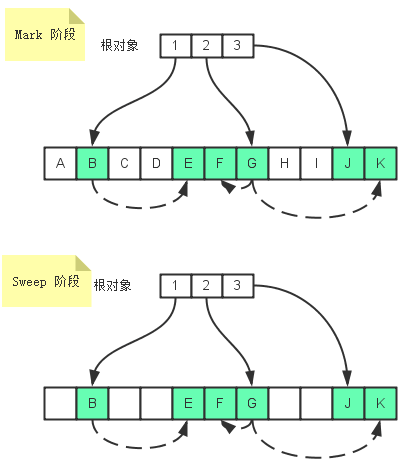

# 内存管理和垃圾回收

[JavaScript 垃圾回收入门](https://segmentfault.com/a/1190000015641168)

## 1. 内存管理
#### 1.1 简介
  - JavaScript 在创建变量（对象，字符串等）时自动进行分配内存；  
  - 在不使用的时候 “自动” 释放，释放的过程就称为垃圾回收  
#### 1.2 内存生命周期
  - 分配你所需要的内存；  
  - 使用分配到的内存（读、写）；
  - 不需要时将其释放；

#### 1.3 内存分配
  > 为了不让程序员费心分配内存，JavaScript 在定义变量时完成了内存分配；
  ##### 值初始化 
  ```JS
  let n = 123;       // 给数值变量分配内存
  let s = 'hello';   // 给字符串分配内存

  // 给对象及其包含的值分配内存
  let obj = {
    a: 1,
    b: null
  }

  // 给数组及其包含的值分配内存
  let a = [1, null, 'hello'];

  // 给函数(可调用的对象)分配内存
  function fn(x){
    return x + 2;
  }

  // 函数表达试分配一个对象
  someElement.addEventListener('click', function() {
    someElement.style.backgroundColor = 'biue'
  }, false)
  ```
  ##### 存储方法：
  - 原始类型数据值占据空间固定，是简单的数据段，为便于提升变量查询速度，将其存储在 **栈（stack）** 中   
  - 对象类型数据 大小会改变，不固定，所以不能将其存放在栈中，否则会降低变量查询速度，因此其存储在 **堆（heap）** 中  
  - 存储在变量处的值是一个**指针**，指向存储对象的内存处；
    

  ##### 使用值：
  - 使用值的过程实际是对分配内存进行读取与写入的操作；
  - 读取与写入可能是写入一个变量或者一个对象的属性值，甚至传递函数的参数；
  
  ##### 释放 （↓ 垃圾回收）
  - 当内存不再需要使用时释放；
  - JavaScript内嵌了垃圾收集器，用来跟踪内存分配和使用，以便当分配的内存不在使用时，自动释放；
  - 垃圾收集器会按照固定的时间间隔，或代码执行中预定的收集时间，周期性执行这一操作；
  - 垃圾收集器会跟踪哪个变量有用哪个变量无用，对于不在有用的变量打上标记，以备将来收回占用的内存； 
  - 垃圾收集器用于标识无用变量的策略通常有 **↓标记清除** 和 **↓引用计数**
  - **局部变量** 只是在函数执行过程中存在，而在这个过程中，会为局部变量在 栈或堆 内存上分配相应的空间，以便存储他们的值，然后在函数中使用这些变量，直到函数执行结束，此时的局部变量就没存在意义，便会释放内存
  
## 2. 垃圾回收

#### 引用计数垃圾收集
- 垃圾回收算法主要 **依赖于引用概念**
- 在内存管理的环境中，一个对象如果有访问另一个对象的权限，叫做一个对象引用另一个对象；  
- 一个JavaScript对象具有对它 **原型的引用（引式引用）** 和 **对属性的引用（显示引用）**  
- **引用计数**算法， 是把 **对象是否不再需要 简化定义 对象有没有其它对象引用到它**； 如果没有引用指向该对象，对象便被垃圾回收机制回收；  

```JS
  // 两个对象 a、b被创建，
  // 一个作为另一个的属性别引用，另一个被分配给变量 o;
  let o ={ a:{ b: 2 } }

  // o2变量是第二个对“这个对象”的引用
  let o2 = o
  //=> 02 = { a:{ b: 2 } };

  // 现在，“这个对象”只有一个o2变量的引用了，
  // “这个对象”的原始引用o已经没有
  o = 1;

  // 引用“这个对象”的a属性
  // 现在，“这个对象”有两个引用了，一个是o2，一个是oa
  let oa = o2.a;

  // 虽然最初的对象现在已经是零引用了，可以被垃圾回收了
  // 但是它的属性a的对象还在被oa引用，所以还不能回收
  o2 = "yo";

  // a属性的那个对象现在也是零引用了
  // 它可以被垃圾回收了
  oa = null;
```

#### 引用计数限制： 循环引用
- 引用计数算法有一个限制,无法处理循环引用的事例
```JS
// 两个对象被创建，并互相引用，形成了一个循环。
// 它们被调用之后会离开函数作用域，所以它们已经没有用了，可以被回收了。
// 然而，引用计数算法考虑到它们互相都有至少一次引用，所以它们不会被回收。
  function f(){
    let o = {};
    let o2 = {};
    o.a = o2; // o 引用 o2
    o2.a = o; // o2 引用 o

    return "azerty";
  }

  f();
```
#### 标记-清除算法
> 这个算法假定设置一个叫做根（root）的对象（在Javascript里，根是全局对象）。定期的，垃圾回收器将从根开始，找所有从根开始引用的对象，然后找这些对象引用的对象……从根开始，垃圾回收器将找到所有可以到达的对象和所有不能到达的对象  

- 标记清除算法把 **对象是否不再需要 简化定义为 对象是否可以获得**；
  - 如果对象没法获得， 对象将被垃圾回收机制回收；
  - 大多数浏览器实现使用的都是标记清除式的垃圾收集策略，只不过收集时间互不相同；
- 该算法分为 **标记(mark)** 和 **清除(sweep)** 两个阶段
  - 在标记阶段，垃圾回收器会从根对象开始遍历，每一个可以从根对象访问到的对象都会被添加一个标识，于是这个对象就被标识为可获得对象  
  - 在清除阶段，垃圾回收器会对内存从头到尾进行线性遍历，如果发现有对象没有被标识为可获得对象，那么就将此对象占用的内存回收，并且将原来标记为可获得对象的标识清除，以便进行下一次垃圾回收操作

   
在标记阶段，从根对象1可以访问到B，从B又可以访问到E，那么B和E都是可到达对象，同样的道理，F、G、J和K都是可到达对象。在回收阶段，所有未标记为可到达的对象都会被垃圾回收器回收  

#### 循环引用不再是问题了
使用标记清除算法，循环引用不再是问题，上面的示例中，函数调用返回之后，两个对象从全局对象出发无法获取。因此，他们将会被垃圾回收器回收

#### 性能
  - 垃圾收集器是周期性运行的，而且如果为变量分配的内存数量很可观，那么回收工作量也是相当大的。在这种情况下，确定垃圾收集时间间隔是一个非常重要的问题  
  - IE的垃圾收集器是根据内存分配量运行的。具体一点说，就是256个变量，4096个对象(或数组)字面量和数组元素(slot)或者64kb的字符串。达到上述任何一个临界值，垃圾收集器就会运行  
  - 这种实现方式的问题在于，如果一个脚本中包含那么多变量，那么该脚本很可能会在其生命周期中一直保有那么多的变量。而这样一来，垃圾收集器就不得不频繁地运行。结果，由此引发的严重性能问题促使IE7重写了其垃圾收集例程   
  - IE7的javascript引擎的垃圾收集例程改变了工作方式：触发垃圾收集的变量分配、字面量和数组元素的临界值被调整为动态修正。IE7中的各项临界值在初始时与IE6相等。如果垃圾收集例程回收的内存分配量低于15%，则变量、字面量和数组元素的临界值就会加倍。如果例程回收了85%的内存分配量，则将各种临界值重置回默认值。这样，极大地提升了IE在运行包含大量javascript的页面时的性能  
  - 事实上，在有的浏览器中可以触发垃圾收集过程。在IE中，调用window.CollectGarbage()方法会立即执行垃圾收集

#### 优化内存占用


---
参考：  
[内存管理](https://developer.mozilla.org/zh-CN/docs/Web/JavaScript/Memory_Management)  
[javascript中的内存管理和垃圾回收](https://www.cnblogs.com/xiaohuochai/p/8528677.html)  
