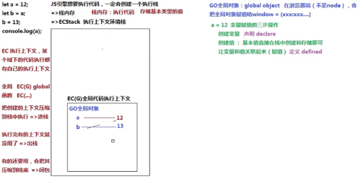

# 堆（heap）栈（stack）内存

## 1 栈：
  - 特点： 
    - 栈是一种LIFO（Last-In-First-Out，后进先出）的数据结构，也就是最新添加的项最早被移除

## 2 堆：
  - 定义：一种存放复杂或者说引用类型的内存区域；
  - 特点：
    - 动态分配的内存，大小不定，不会自动释放;
    - 存放引用类型，包含引用类型的变量，实际上保存的不是变量本身，而是指向该对象的指针。

## 3 栈和堆的区别
  - 堆区（heap）：    
    - 堆内存中的对象不会随方法的结束而销毁，即便方法结束了，这个对象可能被另一个引用变量所以引用，创建对象是为了反复利用，这个对象将被保存到运行时数据区域。
      
  - 栈区（stack）：   
    - 所有在方法中定义的变量都是存放在栈中的，随着方法的执行结束，这个方法的内存栈也自然销毁。存取速度比较快。

## 4. 实例：
  ### 4.1 栈内存
  ```js
   let a = 12;
   let b = a;
   b = 13;
   console.log(a);
  ```

js 要执行代码，就一定会创建一个执行栈；
在栈中可以存储基本类型值；


