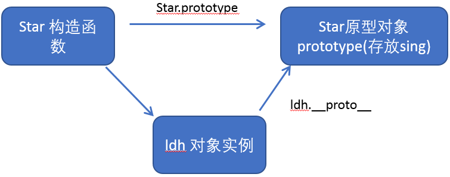
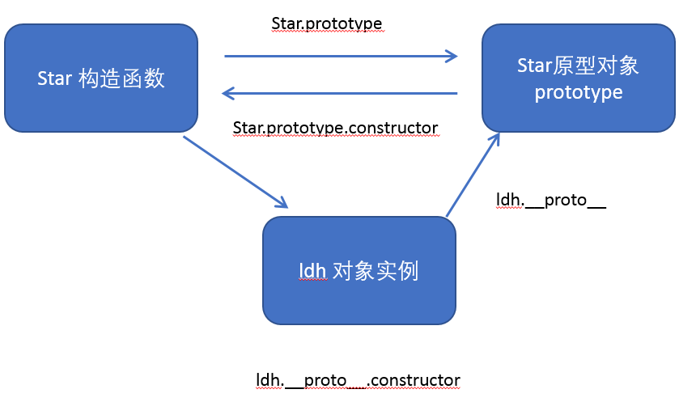
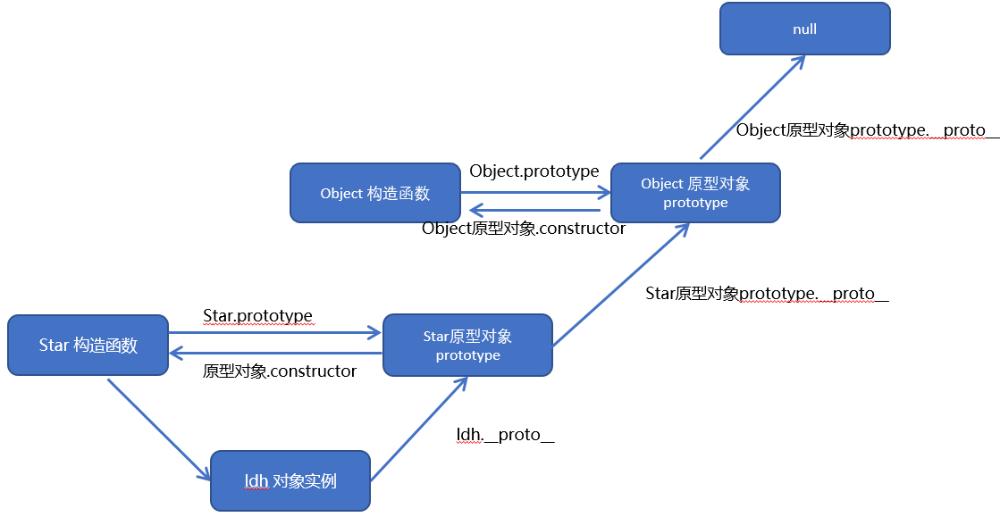

# 原型及原型链
  > 构造函数方法很好用，但是存在浪费内存的问题。
  - 所以 构造函数 可以通过 原型分配 这个对象的所有 **属性和方法共享**。 
  
## 1. Prototype 原型
  - 在JavaScript中，**每一个构造函数都有一个 prototype 属性，指向另一个对象**。
  - 注意这个 **prototype 就是一个对象**，这个对象的所有**属性和方法，都会被构造函数所拥有**。
  - 我们可以把那些不变的方法，直接定义在 prototype 对象上，这样所有对象的实例就可以共享这些方法。
  - __proto__是原型链，指向实例化的函数原型。
    
  ```JS
    //  1. 一般情况下,我们的公共属性定义到构造函数里面, 公共的方法我们放到原型对象身上
    function Star(uname, age) {
        this.uname = uname;
        this.age = age;
        // this.sing = function() {
        //     console.log('我会唱歌');
        // }
    }
    // 2. 这就解决了构造函数 存在浪费内存的问题. 
    Star.prototype.sing = function() {
        console.log('我会唱歌');
    }
    var ldh = new Star('刘德华', 18);
    var zxy = new Star('张学友', 19);
    console.log(ldh.sing === zxy.sing);  // true
    ldh.sing();
    zxy.sing();
  ```
  
## 2. 对象原型 __proto__
  > 对象都会有一个属性 __proto__ 指向构造函数的 prototype 原型对象，之所以我们对象可以使用构造函数 prototype 原型对象的属性和方法，就是因为对象有 __proto__ 原型存在；
  - __proto__对象原型和原型对象 prototype 是等价的  
  - __proto__对象原型的意义就在于为对象的查找机制提供一个方向，或者说一条路线，但是它是一个非标准属性，因此实际开发中，不可以使用这个属性，它只是内部指向原型对象 prototype  
  
  ```JS
    function Star(uname, age) {
        this.uname = uname;
        this.age = age;
    }
    Star.prototype.sing = function() {
        console.log('我会唱歌');
    }
    var ldh = new Star('刘德华', 18);
    var zxy = new Star('张学友', 19);
    ldh.sing();

    // 对象身上系统自己添加一个 __proto__ 指向我们构造函数的原型对象 prototype
    console.log(ldh); 

    console.log(ldh.__proto__ === Star.prototype); // true
    // 方法的查找规则: 首先先看ldh 对象身上是否有 sing 方法,如果有就执行这个对象上的sing
    // 如果么有sing 这个方法,因为有__proto__ 的存在,就去构造函数原型对象prototype身上去查找sing这个方法
  ```
  

## 3. constructor
  > 对象原型（ __proto__）和构造函数（prototype）原型对象里面都有一个属性 constructor 属性 ，constructor 我们称为构造函数，因为它指回构造函数本身。
  - coustructor 主要用于 <font color="red">**记录该对象引用于哪个构造函数**</font>，它可以让原型对象重新指向原来的构造函数；一般情况下， 对象的方法都在构造函数的原型对象中设置。
  - 如果我们修改了原来的原型对象,并且给原型对象 <font color="red">**赋值的是一个对象**, 则必须手动的 **利用constructor指回原来的构造函数** </font>
  ```js
    function Star(uname, age) {
        this.uname = uname;
        this.age = age;
    }
    Star.prototype = {
        // 如果我们修改了原来的原型对象,并且给原型对象赋值的是一个对象,
        // 则必须手动的利用constructor指回原来的构造函数
        constructor: Star,
        sing: function() {
            console.log('我会唱歌');
        },
        movie: function() {
            console.log('我会演电影');
        }
    }
    var ldh = new Star('刘德华', 18);
    var zxy = new Star('张学友', 19);
    console.log(Star.prototype);
    console.log(ldh.__proto__);

    // 主要用于 记录该对象引用于哪个构造函数
    console.log(Star.prototype.constructor); // 打印的是 Star 函数
    console.log(ldh.__proto__.constructor);  // 打印的是 Star 函数
  ```

## 4. 三者之间的关系
  > 构造函数、实例、原型对象三者之间的关系
  1. 创建一个函数，每个构造函数都有一个prototype属性, 指向另一个对象
  2. **原型对象prototype** 有一个 **constructor**, 指回原来的构造函数
  3. 通过构造函数创建一个实例对象（ldh），**构造函数也可以指向实例对象**；
  4. 同时 实例对象（ldh）里，有一个原型 __proto__， 指向了 **原型对象prototype**;
  5. 同时 实例对象（ldh）里, 也有一个 constructor，能够 **指回我们的构造函数**，这个过程是先指向 **原型对象prototype**，然后原型对象的 constructor 指回构造函数（ldh.__proto__.constructor）；

  

## 5. 原型链
  ```js
    function Star(uname, age) {
        this.uname = uname;
        this.age = age;
    }
    Star.prototype.sing = function() {
        console.log('我会唱歌');
    }
    var ldh = new Star('刘德华', 18);
    // 1. 只要是对象就有__proto__ 原型, 指向原型对象
    console.log(Star.prototype);
    console.log(Star.prototype.__proto__ === Object.prototype);
    // 2.我们Star原型对象里面的__proto__原型指向的是 Object.prototype
    console.log(Object.prototype.__proto__);
    // 3. 我们Object.prototype原型对象里面的__proto__原型  指向为 null
  ```
  

## 6. 成员查找机制
  - 当访问一个对象的属性（包括方法）时，首先查找这个对象自身有没有该属性。
  - 如果没有就查找它的原型（也就是 __proto__指向的 prototype 原型对象）。
  - 如果还没有就查找原型对象的原型（Object的原型对象）。 
  - 依此类推一直找到 Object 为止（null）。
  - __proto__对象原型的意义就在于为对象成员查找机制提供一个方向，或者说一条路线。


## 7. 原型对象this指向
  - 构造函数中的this **指向我们实例对象**;
  - 原型对象里面放的是方法,  这个方法里面的this 指向的是 这个方法的**调用者**, 也就是这个实例对象.
  ```js
    function Star(uname, age) {
        this.uname = uname;
        this.age = age;
    }
    var that;
    Star.prototype.sing = function() {
        console.log('我会唱歌');
        that = this;
    }
    var ldh = new Star('刘德华', 18);
    // 1. 在构造函数中,里面this指向的是对象实例 ldh
    ldh.sing();
    console.log(that === ldh);

    // 2.原型对象函数里面的this 指向的是 实例对象 ldh
  ```

## 8. 扩展内置对象方法
> 可以通过原型对象，对原来的内置对象进行扩展自定义的方法。比如给数组增加自定义求偶数和的功能  
- <font color="red">注意：数组和字符串内置对象不能给原型对象覆盖操作 Array.prototype = {} ，只能是 Array.prototype.xxx = function(){} 的方式。</font>
```js
// 原型对象的应用 扩展内置对象方法
Array.prototype.sum = function() {
    var sum = 0;
    for (var i = 0; i < this.length; i++) {
        sum += this[i];
    }
    return sum;
};
// Array.prototype = {
//     sum: function() {
//         var sum = 0;
//         for (var i = 0; i < this.length; i++) {
//             sum += this[i];
//         }
//         return sum;
//     }

// }
var arr = [1, 2, 3];
console.log(arr.sum());
console.log(Array.prototype);
var arr1 = new Array(11, 22, 33);
console.log(arr1.sum());
```


#### 写一个比较好的例子
```JS
//一段HTML走起 
 <div id='example'></div>

//JS
function ElemDom(id) {
    this.elemDom = document.getElementById(id)
};

//定义一个写入内容的方法
ElemDom.prototype.html = function(val){
    var tempElemDom = this.elemDom;
    if(val){
        tempElemDom.innerHTML = val;
        return this;//这里为什么要return this
    }else {
        return tempElemDom.innerHTML
    }
}

//定义一个事件
ElemDom.prototype.on = function(type,fn){
    var tempElemDom = this.elemDom;
    tempElemDom.addEventListener(type,fn);
    return this;
}

var divDom = new ElemDom('example');
divDom.html('<p>hello world</p>').on('click',function(){
  console.log('i am coming')
}).html('<h1>footer</h1>')

```