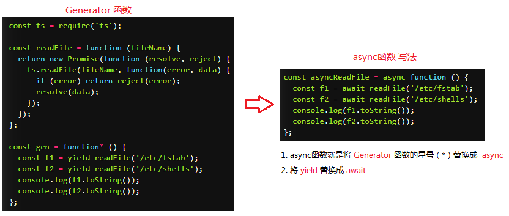

# Async/Await

## 1. 简介
 1. async/await是es7推出的一套关于 **异步编程解决方案**  
 2. 它就是 Generator 函数的 **语法糖**  
 3. async函数返回一个 **Promise 对象**

   
 
 4. 优点：
  - 1. **内置执行器** Generator 函数的执行必须靠执行器，所以才有了 co 函数库，而 async 函数自带执行器。也就是说，async 函数的执行，与普通函数一模一样，只要一行。 
  - 2. **更好的语义** async 和 await，比起星号和 yield，语义更清楚了。async 表示函数里有异步操作，await 表示紧跟在后面的表达式需要等待结果。  
  - 3. **更广的适用性** co 函数库约定，yield 命令后面只能是 Thunk 函数或 Promise 对象，而 async 函数的 await 命令后面，可以跟 Promise 对象和原始类型的值（数值、字符串和布尔值，但这时等同于同步操作）。

## 2. 基础语法
  - async函数返回一个 Promise 对象，可以使用then方法添加回调函数。

  #### 2.1 语法
  ```js
    // 定义一个异步函数（假设他是一个异步函数）
    function getJSON(){
      return 'JSON'
    }

    // 在需要使用上面异步函数的函数前面，加上async声明，声明这是一个异步函数
    async function testAsync() {
      // 在异步函数前面加上await，函数执行就会等待用await声明的异步函数执行完毕之后，在往下执行
      const symbol = await getJSON()
      // ...剩下的代码
      return symbol;
    }

    testAsync().then(res => {
      console.log(res)   // JSON
    })
  ```

  #### 2.2 使用形式
  ```js
    // 函数声明
    async function foo() {}

    // 函数表达式
    const foo = async function () {};

    // 对象的方法
    let obj = { async foo() {} };
    obj.foo().then(...)

    // Class 的方法
    class Storage {
      constructor() {
        this.cachePromise = caches.open('avatars');
      }

      async getAvatar(name) {
        const cache = await this.cachePromise;
        return cache.match(`/avatars/${name}.jpg`);
      }
    }

    const storage = new Storage();
    storage.getAvatar('jake').then(…);

    // 箭头函数
    const foo = async () => {};
  ```
  
  #### 2.3 注意
  1. async函数在声明形式上和普通函数没有区别，函数声明式，函数表达式，对象方法，class方法和箭头函数等都可以声明async函数。  
  2. <font color="red">任何一个await语句后面的 Promise 对象变为reject状态，那么整个async函数都会中断执行。</font>   
  3. async函数返回的 Promise 对象，**必须等到内部所有await命令后面的 Promise 对象执行完，才会发生状态改变**，
      除非遇到return语句或者抛出错误。也就是说，只有async函数内部的异步操作执行完，才会执行then方法指定的回调函数。  

## 3. await 命令
  - await命令后面 **是一个 Promise 对象**， 返回该对象的结果  
  - await命令后面 **不是一个 Promise 对象**，就直接返回对应的值。
  ```js
  // await命令后面 **不是一个 Promise 对象**，就直接返回对应的值
    async function f() {
      // 等同于
      // return 123;
      return await 123;
    }

    f().then(v => console.log(v))
  ```

  ```js
    // await命令后面 是一个 Promise 对象， 返回该对象的结果 
    function sleep(interval) {
      return new Promise(resolve => {
        setTimeout(resolve, interval);
      })
    }

    // 用法
    async function one2FiveInAsync() {
      for(let i = 1; i <= 5; i++) {
        console.log(i);
        await sleep(1000);
      }
    }

    one2FiveInAsync();
  ``` 

## 4. 错误处理
  - 如果await后面的**异步操作出错**，那么等同于 **async** 函数返回的 **Promise 对象被reject**。
  - 防止出错的方法, 可以用到es5里面的 **try/catch**， 来进行错误的捕获  

  ```js
    async function myFunction() {
      try {
        await somethingThatReturnsAPromise();
      } catch (err) {
        console.log(err);
      }
    }

    // 另一种写法
    async function myFunction() {
      await somethingThatReturnsAPromise()
      .catch(function (err) {
        console.log(err);
      });
    }
  ```
  #### 4.1 try/catch 实现一个错误捕获例子
  ```js
    async function main() {
      try {
        const val1 = await 111;
        const val2 = await 222;
        // 在这里抛出一个错误 try/catch则会跑catch代码
        const val3 = await new Promise((resolve, reject) => {
          throw new Error('出错了');
        });
        console.log('val3: ', val3);
      }
      catch (err) {
        console.error(err);   // 出错了
      }
    };
    main().then(res => {
      console.log(res)  // undefind
    })
  ```


  #### 4.2 实现多次重复尝试
   > await操作成功，就会使用break语句退出循环; 失败，会被catch语句捕捉，然后进入下一轮循环。
   - 创建一个 promise1，生成随机数大于 1 则返回成功，否则抛出错误；
   - await 接收到 promise1 错误，就继续再次执行 promise1 函数
  ```js
  function promise1(){
    return new Promise((resolve,reject) => {
      setTimeout(()=>{
        //生成1-10的随机数
        var num = Math.ceil(Math.random()*20); 
        console.log(num)
        if(num<=1){
          resolve(`promise1: ${num}`);
        }else{
          reject(`promise1: ${num} 大于 1 了即将执行失败回调`);
        }
      }, 1000);
    })
  }
  async function test() {
    let i;
    for (i = 0; i < 100; ++i) {
      try {
        await promise1();
        break;
      } catch(err) {}
    }
    console.log(i); // 
  }

  test();
  ```

## 5. 使用注意
  - 1. await命令后面的Promise对象，运行结果可能是rejected，所以最好**把await命令放在try...catch代码块中**
  - 2. **多个await命令**后面的异步操作，如果不存在继发关系，最好让它们同时触发。
  - 3. await命令**只能用在async函数之中**，如果用在普通函数，就会报错。

  ```js
    // 1. getFoo和getBar是两个独立的异步操作（即互不依赖），被写成继发关系。
    // 这样比较耗时，因为只有getFoo完成以后，才会执行getBar，完全可以让它们同时触发。
    let foo = await getFoo();
    let bar = await getBar();
    

    // 写法一
    let [foo, bar] = await Promise.all([getFoo(), getBar()]);

    // 写法二
    let fooPromise = getFoo();
    let barPromise = getBar();
    let foo = await fooPromise;
    let bar = await barPromise;
  ```


## 6. async 函数的实现
  - **async 函数的实现，就是将 Generator 函数和自动执行器，包装在一个函数里**

  ```js
    async function fn(args){
      // ...
    }

    // 等同于

    function fn(args){ 
      return spawn(function*() {
        // ...
      }); 
    }
  ```
  所有的 async 函数都可以写成上面的第二种形式，其中的 spawn 函数就是自动执行器。  
  下面给出 spawn 函数的实现，基本就是前文自动执行器的翻版。  

  ```js
    function spawn(genF) { 
      return new Promise(function(resolve, reject) {
        var gen = genF();
        function step(nextF) {
          try {
            var next = nextF();
          } catch(e) {
            return reject(e); 
          }
          if(next.done) {
            return resolve(next.value);
          } 
          Promise.resolve(next.value).then(function(v) {
            step(function() { return gen.next(v); });      
          }, function(e) {
            step(function() { return gen.throw(e); });
          });
        }
        step(function() { return gen.next(undefined); });
      });
    }
  ```