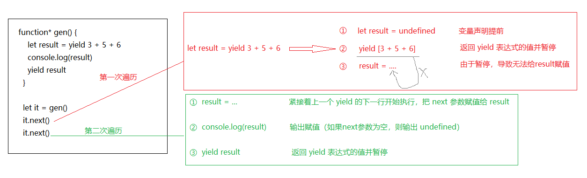

# Generator 函数

## 1. 简介
  - ES6 提供的一种异步编程解决方案，语法行为与传统函数完全不同；
  - 是一种状态机，封装了多个内部状态。
  - 执行 Generator 函数会返回一个遍历器对象，依次遍历 Generator 函数内部的每一个状态。

## 2. generator
  - 形式上也是一个普通函数，但有几个显著的特征：
    - function 关键字与函数名之间有一个星号 " * " （推荐紧挨着function关键字） 
    - 函数体内使用 yield 表达式，定义不同的内部状态 （可以有多个yield）  
    - 直接调用 Generator函数并不会执行，也不会返回运行结果，而是返回一个遍历器对象（Iterator Object） 
    - 依次调用遍历器对象的next方法，遍历 Generator函数内部的每一个状态  
  ```js
    function* helloWorldGenerator() {
      yield 'hello'     // yield 表达式是暂停执行标记
      yield 'world'
      return 'hello world'
    }
    let hel = helloWorldGenerator();
    // {value: "hello", done: false}，value 表示返回值，done 表示遍历还没有结束
    hel.next()  
    
    // {value: "world", done: false}，value 表示返回值，done 表示遍历还没有结束
    hel.next()  

    // {value: "hello world", done: true}，value 表示返回值，done 表示遍历结束
    hel.next()  
  ```
    - 调用 Generator 函数，返回一个遍历器对象，代表 Generator 函数的内部指针
    - 每次调用遍历器对象的next方法，就会返回一个有着value和done两个属性的对象
    - value属性表示当前的内部状态的值，是yield表达式后面那个表达式的值；
    - done属性是一个布尔值，表示是否遍历结束。

## 3. yield 表达式
  由于 **Generator** 函数返回的遍历器对象，只有调用next方法才会遍历下一个内部状态，所以**其实提供了一种可以暂停执行的函数**。yield表达式就是**暂停标志**。

  #### 遍历器对象的 next 方法的运行逻辑如下：
  1. 遇到 yield 表达式，暂停执行后面的操作，并将紧跟在 yield 后面的表达式值作为返回的对象的 value 属性值  
  2. 下次调用 next 方法时，再继续往下执行，直到遇到下一个 yield 表达式
  3. 如果**没有遇到新的yield表达式**，就一直运行到函数结束，直到return语句为止，并将return语句后面的表达式的值，作为返回的对象的value属性值。  
  4. 如果该函数**没有return**语句，则**返回的对象的value属性值为undefined**。
  5. yield 表达式**只能用在 Generator 函数里面**，用在其它地方都会报错

  ```js
    function* foo() {
      yield 'aaa'
      yield 'bbb'
    }

    function* bar() {
      yield* foo()      // 在bar函数中 **执行** foo函数
      yield 'ccc'
      yield 'ddd'
    }

    let iterator = bar()

    for(let value of iterator) {
      console.log(value)
    }

    // aaa
    // bbb
    // ccc
    // ddd
  ```

## 4. next 方法的参数
  > yield表达式 **本身没有返回值** ，或者说总是返回undefined。next方法可以带一个参数，该参数就会被 **当作上一个yield表达式的返回值**  

  ```js
    [rv] = yield [expression]

    expression：定义通过遍历器从生成器函数返回的值，如果省略，则返回 undefined
    rv：接收从下一个 next() 方法传递来的参数
  ```

  ```JS
    function* gen() {
      // 1. 声明了一个变量result，并将声明提前，默认值为 undefined
      // 2. 由于 Generator函数是 “惰性求值”，执行到第一个 yield 时才会计算求和，
      // 并加计算结果返回给遍历器对象 {value: 14, done: false}，函数暂停运行
      let result = yield 3 + 5 + 6

      // 3.理论上应该要把等号右边的 [yield 3 + 5 + 6] 赋值给变量result，
      // 但是，由于函数执行到 yield 时暂定了，这一步就被挂起了
      console.log(result)
      yield result
    }

    let it = gen()
    let a1 = it.next()  // {value: 14, done: false}    
    // console.log(it.next())      //{value: undefined, done: false}
    // console.log(it.next(3))      //{value: 3, done: false}
    console.log(it.next(a1.value))      // {value: 14, done: false}
  ```

  第二次调用next方法，函数从上一次 yield 停下的地方开始执行，也就是给result赋值的地方开始，由于next()并没有传参，就相当于传参为undefined
  